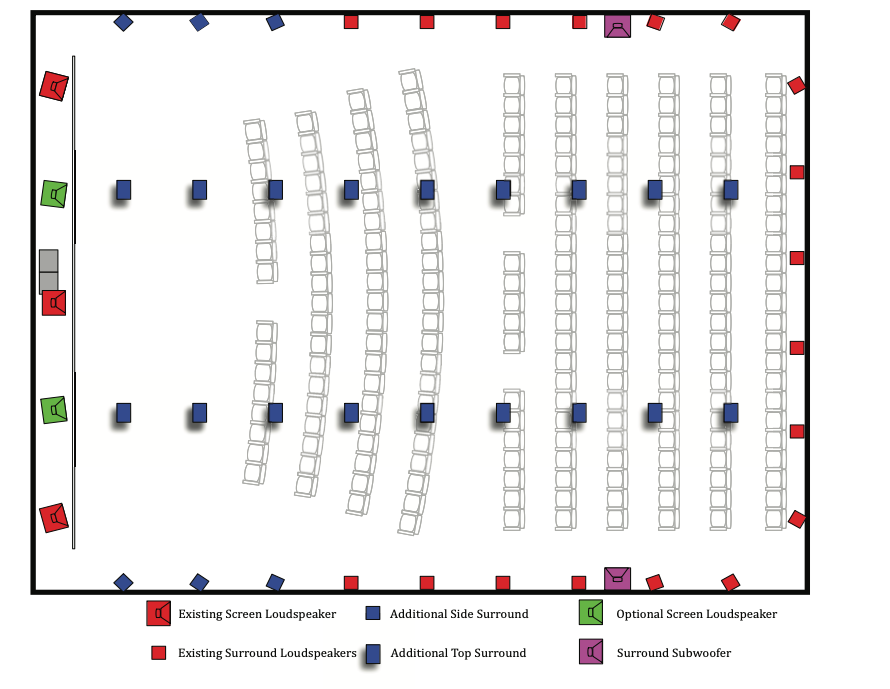
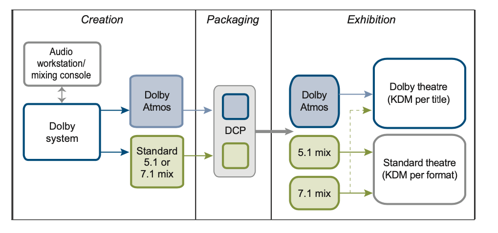

+++
title = "Atmos Movies"
outputs = ["Reveal"]
[reveal_hugo]
margin = 0.2
+++

# Dolby Atmos with films

---

## A somewhat critical take

{}

- **Introduction**: While Dolby Atmos is now a prominent technology in music, it's crucial to remember that it was initially designed for mixing films.
  
- **First Use in Film**: Interestingly, the first film to use Dolby Atmos wasn't a feature-length blockbuster but a Pixar short called "Leaf," which played before the movie "Brave." It's noteworthy that "Leaf" is not listed on IMDb for some reason, adding a layer of mystery to its pioneering role.

- **Development Timeline**: The concept of Dolby Atmos dates back to 2007, according to Stuart Bowling, the senior technical marketing manager for cinema at Dolby at the time. 

- **Initial Catalyst**: The initiative to create Dolby Atmos was a response to a query from a major exhibitor. This exhibitor foresaw changes in theater design due to advancements in imaging technology and felt that audio needed to evolve in tandem.

- **Challenges and Considerations**: One of the limitations in the early development stage was that the footprint of digital technology in the industry was still relatively small, which somewhat constrained Dolby's ability to enact industry-wide changes.

- **Source Citation**: The information is drawn from an article on Film Journal, which has been archived [here](https://web.archive.org/web/20130228051002/http://www.filmjournal.com/filmjournal/content_display/esearch/e3i6bc2381e4316e9773b5d74a8c3c72916).

{}

---

<iframe src="https://player.vimeo.com/video/40658763?h=c6601dc8cc" width="640" height="360" frameborder="0" allow="autoplay; fullscreen; picture-in-picture" allowfullscreen></iframe>

<a href="https://vimeo.com/40658763">Dolby Perspective on Dolby Atmos</a> from <a href="https://vimeo.com/dolby">Dolby Laboratories</a> on <a href="https://vimeo.com">Vimeo</a>.

{}
### Slide Title: Dolby's Ambitions and Impact with Atmos 

#### Speaker Notes:

- **Dolby's Vision for Atmos**: At the time of its launch, Dolby presented Atmos as more than just a technical novelty; it was pitched as the future of cinema sound, aiming for ubiquitous adoption in "every movie and every theater."

- **Strategic Importance**: According to film historian Gianluca Sergi, Atmos was crucial for Dolby's business strategy, aiming to reclaim the dominant position it once held in the cinema market, especially after experiencing revenue decline in its digital cinema division over two years.

- **Outreach and Promotion (2010-2013)**: Dolby executed a robust marketing strategy that included reaching out to sound practitioners, directors, studios, and major theater chains. They offered financial incentives, complimentary training sessions, and extensive trade advertising to promote Atmos as the next big thing in cinema sound.

- **Redefining Sound Mixing**: Dolby Atmos not only proposed new technology but also encouraged a re-evaluation of existing sound mixing conventions in Hollywood. This was tied closely to the professional identities and practices of mixers themselves.

- **Controversial Impact on Mixers**: Although Dolby claimed that Atmos would grant mixers more artistic control throughout various stages of production and exhibition, there is evidence suggesting that the platform may actually limit a mixer's creative role in authoring soundtracks.

- **Source Citation**: The information is drawn from academic analyses and historical accounts, including insights from film historian Gianluca Sergi and trade documentation from the period between 2010 and 2013.

{}

---

## Implications

- Technological: who does the rendering algorithm serve?
- Occupational: who authored the 5.1 version of an Atmos film?
- Aesthetic: does "lifelike" describe what mixers actually want?

{}

- The claim to argue about: Dolby sold Atmos as giving mixers more control, and several mixers experienced the automatic downmix as less.
- Read aloud and compare: the whitepaper's "Author Once, Optimize Everywhere" against the mixer complaints Sergi documents.
- The aesthetic tension in one line: Dolby's documents promise "lifelike audio," while working mixers describe mixing for dramatic feel, which is often deliberately unrealistic.
- Sources: Dolby's Atmos whitepaper (2013, linked below) and Gianluca Sergi's analysis of the 2010-2013 rollout.

{}

---

See [this whitepaper](Dolby_Atmos_Next_Generation_Audio_for_Ci.pdf) for some interesting details of the system in 2013.

---

## The Channel Wars

- 2008
  - AMC Theaters asked Dolby Labs to find the next tech for multichannel audio for film
    - Dolby came back with 7.1 - premiered with Toy Story 3 (2010)
    - A precursor to Atmos
  - Tomlinson Holman (5.1 and THX) - created 10.2
  - Karlheinz Brandenburg - IOSONO
  - Barco - Auro - 11.1

{}
- **Introduction**: 
Before diving into Dolby Atmos, it's worth revisiting the landscape of multichannel audio for films that set the stage for Atmos. This period witnessed numerous innovations as the industry transitioned to digital cinema.

- **AMC Theaters & Dolby Labs (2008)**:
AMC Theaters challenged Dolby Labs in 2008 to develop the next wave of multichannel audio for film. Their objective was to emulate the success of digital 3D in boosting ticket sales but through a superior audio experience.

- **Digital Cinema's Global Footprint (2010)**:
By 2010, digital cinema was becoming the norm, with nearly 16,000 screens worldwide. The Digital Cinema Package (DCP) could support up to sixteen channels of digital audio, which presented a fertile ground for advancements in sound technology.

- **Other Notable Audio Formats**:
Several other multichannel formats emerged during this period. Tomlinson Holman developed a 10.2 format, while Karlheinz Brandenburg's IOSONO used 64 channels and 600 speakers to create a “high-dimensional experience.” Barco's Auro, although now defunct, also attempted to push the boundaries with its 11.1 process.

- **Dolby’s Initial Steps: Dolby Surround 7.1 (2010)**:
Dolby’s initial response to AMC's challenge was the introduction of Dolby Surround 7.1, which premiered with Toy Story 3. This was not merely an incremental upgrade; the 7.1 format marked Dolby's cautious entry into digital cinema. It improved the existing surround sound experience and laid the groundwork for more audacious projects, leading eventually to Dolby Atmos after two more years of research and development.

{}

---

{}

- **7.1 vs. Dolby Atmos**: 
Traditional 7.1 environments divide surround sound into four zones, each with identical audio information. Dolby Atmos, in contrast, aims to reflect the complexities of real-world sound environments, where sounds can originate from various points in space.

- **Dolby Rendering and Mastering Unit (RMU)**: 
The RMU is an integral part of the Dolby Atmos system. It automates the process of rendering audio for different room configurations. After an Atmos mix is made, the RMU algorithm can auto-generate versions for 5.1 and 7.1 setups based on a theater's specific loudspeaker layout.

- **Stuart Bowling's Explanation**:
According to Stuart Bowling, the key advantage here is the principle of "author once and render anywhere." This means the original intent of the sound mixer is preserved across different sound environments. From a large theater with a 7.1 setup to a smaller one with a 5.1 configuration, the same DCP file package can be used.

- **A Double-Edged Sword**:
While Atmos provides a significant innovation in digital cinema storage and delivery by creating a unified DCP file for multiple configurations, its optimization technology is a subject of controversy. This automatic rendering process has raised questions regarding the creative control mixers have over the final audio output in various environments.

{}

---

{}
- **The Atmos Rendering Tool**:
The Atmos rendering tool can automatically create 5.1 and 7.1 versions from an original Atmos mix. While this enhances versatility and ease of distribution, it raises significant questions about artistic agency. The tool essentially changes the nature of a sound mixer's work, which has increasingly become specialized due to the digital formats and platforms involved.

- **"Author Once, Optimize Everywhere" Explained**:
Stuart Bowling explains that Dolby's rendering algorithm aims to preserve the mixer’s "true intent" as it adapts to various theater configurations. The algorithm works by optimally using the available speakers in the theatre, repositioning audio objects based on what speakers are present, rather than adhering to a specific output channel.

- **Nicolas Tsingos' Take**:
According to Nicolas Tsingos, Dolby's senior platform manager, the algorithm essentially selects the most suitable set of speakers for each sound and plays it from those. While this sounds like an optimal use of resources, it also potentially takes away some of the control that the sound mixer has over how their work is represented across different formats.

- **Tension Between Technical and Creative Control**:
Dolby seems to conflate technical control with creative control. While the automation offers a certain level of convenience and adaptability, it comes at the cost of reducing a mixer's authority and agency in translating their work from one format to another. This has implications for mixers who want to maintain a competitive and unique artistic identity.

{}

---

## The Sound of _Flight_

<iframe width="560" height="315" src="https://www.youtube.com/embed/HZzgvUcAtXc" title="YouTube video player" frameborder="0" allow="accelerometer; autoplay; clipboard-write; encrypted-media; gyroscope; picture-in-picture" allowfullscreen></iframe>

{}
Some details about how a film is typically mixed, the sound mix being the "final rewrite."
{}

---

## Chanel-based vs Atmos

- channel-based - baked in positional data
- Atmos - flexible with the render algorithm

{}

- The claim: a channel-based mix bakes positions into the delivery, while Atmos keeps elements fluid and lets an algorithm author the 5.1 and 7.1 versions.
- The stake: mixers describe the mix as a film's "final rewrite." If the renderer generates the versions most audiences hear, who wrote the final rewrite?
- Ask: is this different in kind from the control mixers already lose to theater playback, or only in degree?

{}

---

## Realism in sound production - conventions

- 1920s - music recording vs. telephone industries

{}
### Two Paradigms of Realism in Sound Representation: A Summary

#### Camp 1: Fidelity-Led Realism
- Led by Joseph P. Maxfield of Bell Laboratories.
- Advocates for duplicating the original event in sound recordings.
- Aims for the audience to be "conceptually and practically a part of the space of representation."
- Challenged by the requirements of film narration, which often require multiple sound elements to be fused into a single track.

#### Camp 2: Intelligibility-Led Realism
- Led by engineers from AT&T and the telephony industry.
- Values clarity and intelligibility of speech over strict fidelity to the original sound.
- Dates back to as early as 1930; film sounds are separated into tracks, with dialogue prioritized.
- Willing to compromise on realistic sound and picture scales for the sake of clear, narratively significant sound elements.

#### Tensions Between the Two Camps
- Fidelity-Led Realism seeks to immerse the audience in a space that mirrors the original sound environment, potentially complicating film narratives.
- Intelligibility-Led Realism makes concessions for the sake of storytelling, sacrificing absolute fidelity to elevate dialogue and other key elements.

#### Implications for Film Soundtracks
- The tug-of-war between fidelity and intelligibility has influenced the development and philosophy behind various sound technologies and film soundtracks.
- Rick Altman and others note that the historical emphasis has often been on intelligibility, particularly in terms of elevating dialogue in the sound mix.

In summary, these two differing paradigms highlight the inherent tension between achieving high-fidelity sound representation and meeting the narrative requirements of film, which often prioritize clarity and intelligibility.

{}

---

> “Motion pictures are not reality. The best you can do is be sparing. If someone is walking down the street, I know I need traffic, but I don’t need a car effect for every one I see”
>
> -- Richard Portman

{}
### The Art of Sound Mixing and the Quest for "Idealized Reality": A Discussion

#### Richard Portman's Perspective
- Film sound veteran Richard Portman emphasizes that movies are not reality.
- Advocates for a restrained approach in sound design, using only essential sound effects that support the narrative or scene.
- Illustrates that sometimes less is more; for instance, not every visible car on screen needs an accompanying car sound effect.

#### John Belton's Theory on "Idealized Reality"
- John Belton, a film historian and theorist, posits that both classical and contemporary sound editing aim for an "idealized reality."
- Argues that this idealized reality is a crafted version of the world where every sound has a purpose and meaning.
- Suggests that unnecessary sounds — those that don't contribute to understanding or significance — should be filtered out.

#### Balancing Realism and Significance
- Both Portman and Belton point to the selective nature of sound mixing for films, advocating for an "idealized reality" rather than an exact duplication of real-world sounds.
- The objective is not merely to replicate reality but to create a compelling and coherent audio-visual experience, where the sounds used are deliberate and meaningful.
  
{}

---

## Clarity vs density

{}
### Summary: Mixing for "Feel" and Dolby Atmos White Paper

#### Mixing for "Feel" in Contemporary Practices
- Mixing involves artistic decisions to suit the context of a scene.
- Clarity might be prioritized for critical plot points.
- Density could be emphasized to create a sense of disorder or chaos.

#### Dolby Atmos White Paper's Perspective
- Dolby Atmos aims to provide "lifelike" and highly realistic audio.
- The system includes a top loudspeaker channel for sound from the upper hemisphere.
- Expanding top and rear channels enhances audio object fluidity in the theater.
- In Dolby's view, this prevents the need for the audience to mentally construct a "phantom image" of the sound space.
{}

---

> The ability to precisely position sources anywhere in the surround zones also improves the audio/visual transition from screen to room. If a character on the screen looks inside the room toward a sound source, the mixer has the ability to precisely position the sound so that it matches the character’s line of sight, and the effect will be consistent throughout the audience.
>
> Whitepaper

{}
### Summary: Relationship between Early Sound Practices and Dolby Atmos

#### Early Sound Practices
- Early sound design aimed to match sound and picture scales.
- The goal was to preserve fidelity between what is seen and heard.

#### Dolby Atmos' Objectives and Techniques
- Atmos also seeks a strict correlation between sound and picture point sources.
- It tries to match the sound precisely with its visual representation on screen and in the theater.
- Atmos literalizes the position between sound and picture.

#### Impact on Audience Experience
- Atmos aims to immerse the audience in the original three-dimensional sound space.
- This is despite the fact that such an "original sound event" does not actually exist.

Dolby Atmos carries the ethos of early sound practices into contemporary sound design, striving for a heightened sense of realism and fidelity by meticulously matching audio and visual elements.
{}

---

> Consider the example of being in a restaurant. In addition to ambient music apparently being played from all around, subtle but discrete sounds originate from specific points: a person chatting from one point, the clatter of a knife on a plate from another. Being able to place such sounds discretely around the auditorium can add a heightened sense of realism without being obvious.
>
> (ibid.)

{}
### Summary: Dolby Atmos and the Gap Between Theory and Practice

#### Atmos' Conceptual Goal
- Dolby engineers designed Atmos to mimic how we experience sound in daily life.
- The aim is to bring filmmakers and audiences closer to everyday auditory experiences.

#### Discrepancy with Hollywood Mixing Conventions
- Suggesting that a "heightened sense of realism" can be achieved by panning sounds to specific speakers may conflict with traditional Hollywood mixing practices.
- This focus on realism and particular speaker usage may come at the expense of narrative transparency.

#### The Gap in Atmos
- A gap exists between Atmos as a theoretical audio concept and its utility as a practical mixing tool.

Dolby Atmos aims to revolutionize the auditory experience in cinema by striving for a natural, lifelike sound environment. However, this ambition can create a conflict with established Hollywood mixing norms that often prioritize narrative clarity. This dichotomy reveals a tension between Atmos' theoretical aspirations and its practical applications in the world of film sound design.
{}

---

## The sound of _Man Of Steel_

<iframe width="560" height="315" src="https://www.youtube.com/embed/ewKMOpelgQ0" title="YouTube video player" frameborder="0" allow="accelerometer; autoplay; clipboard-write; encrypted-media; gyroscope; picture-in-picture" allowfullscreen></iframe>

---

> My hope was that we could be subtle with it and not be like 3-D, even though we have the opportunity to do it. So what we ended up doing was taking music and using the whole room, so we have percussion and strings and brass up front. Long strings stay in the front, but short strings you can bring back to a quarter way back of the room. Choirs can play overhead. What you end up with is like a cathedral.
>
> Chris Jenkins (“The Sound of Man of Steel”)

{}
- The claim: given the format built for point-source effects panning, Jenkins and Montaño instead spatialized Hans Zimmer's score, placing choir overhead and splitting strings by length across the room. The quote on the slide is the whole argument, and "what you end up with is like a cathedral" is the line to sit on.
- Ask: is this a use of Atmos or a refusal of it? Their choice extends the old practice of putting ambience in the surrounds rather than Dolby's vision of discrete objects.
{}

---

> Sometimes we get lost in the novelty of what we bring to the table. I’m always conscious of the first-time viewer. Are we getting the story? Are we clearing dialogue? We don’t want anybody to lean over and say, “What did they say?” So I always try to err on clarity. If that means sacrificing whatever is at your fingertips, so be it. You have to be sensitive to all the disciplines of dialogue, music, and sound effects. (“The Sound of Man of Steel”)

{}
- The claim: Jenkins pushes score into the surrounds to free the screen channels for dialogue, which is intelligibility-led realism winning over Dolby's fidelity-led kind. The quote carries it: "I always try to err on clarity."
- Connect back to the 1920s slide: the Maxfield versus AT&T split resurfaces intact inside a 2013 format debate.
{}

---

> “Sound people tend to be pigeonholed as technicians, which is a tragedy, because we’re artists first and foremost. I honestly don’t think adding more channels to a movie theater are [sic] going to improve movies significantly—5.1, 11.1, or 101.1”
>
> Randy Thom

{}
### Summary: Challenges and Uncertainties in the Adoption of Dolby Atmos

#### Randy Thom's View on Industry Focus
- Randy Thom expresses disappointment over the industry prioritizing technical novelty over artistic practice.

#### Historical Context and Commercial Uncertainty
- Dolby Digital 5.1 took nearly two decades to become widely adopted.
- Despite endorsements from high-profile directors, it's too early to declare Atmos a commercial success.
- Dolby continues to train mixers and convince exhibitors to adopt the system, while also facing competition.

#### Re-Evaluation of Mixing Practices
- Atmos calls for a significant shift in mixing ideology, similar to the impact of four-channel Dolby Stereo in the 1970s.

{}

---

## Conclusion

- Challenging convention?

{}
- Where the deck lands: Atmos both challenges convention (the renderer authors versions of the mix) and conforms to it (mixers like Jenkins bend the system back toward intelligibility-led practice).
- Close on Thom's "101.1" quote from the previous slide and ask the room: after a semester of mixing in these formats, do you side with Thom or with Dolby?
{}
