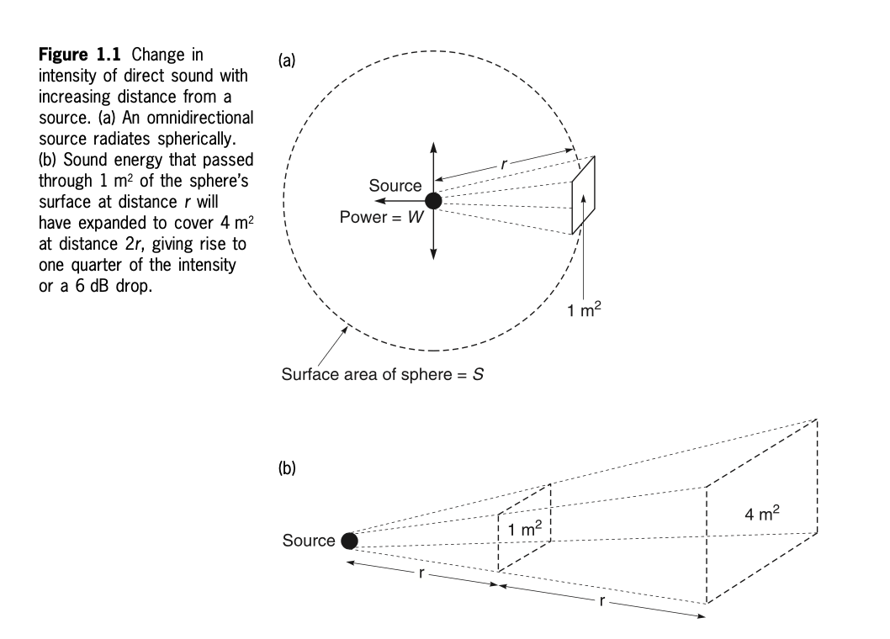
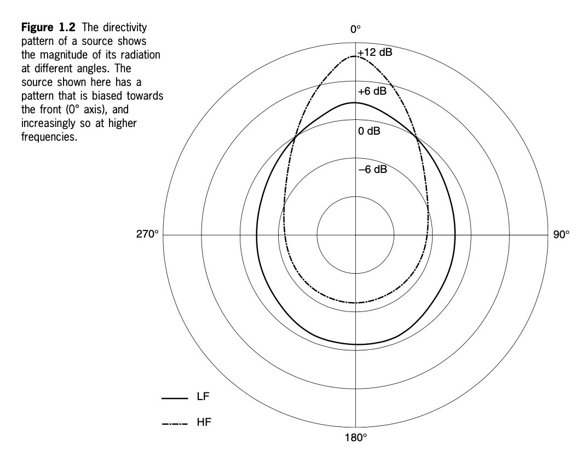
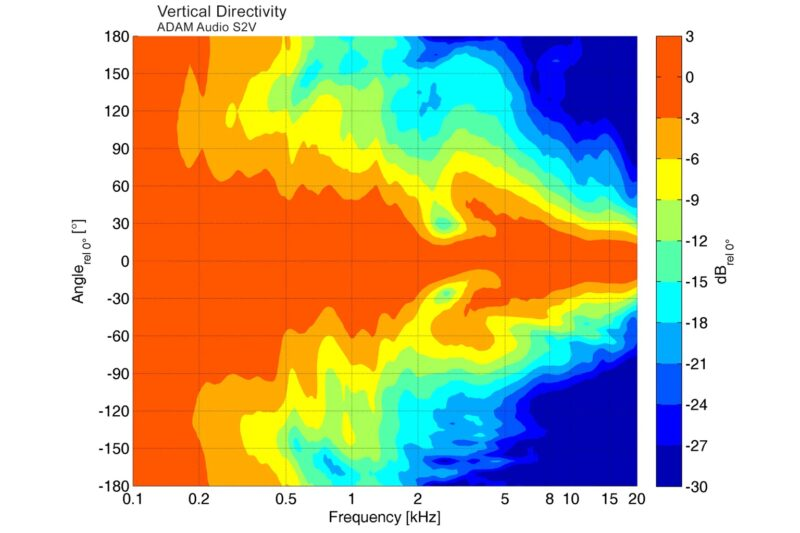
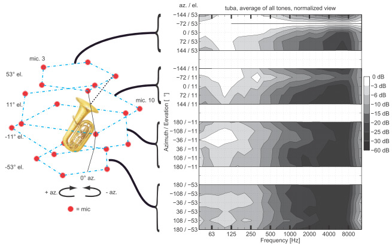
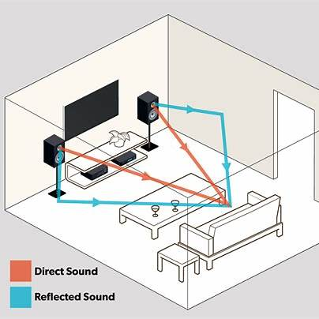
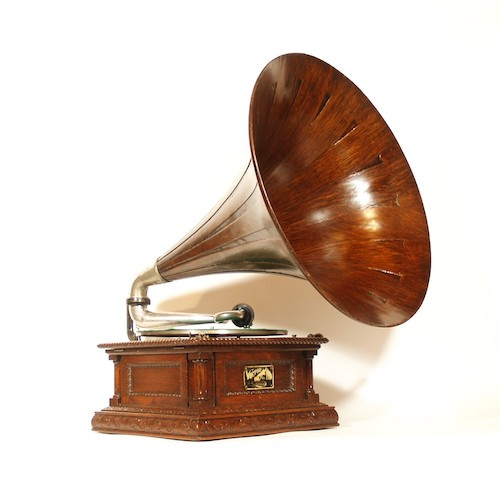
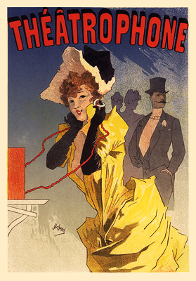
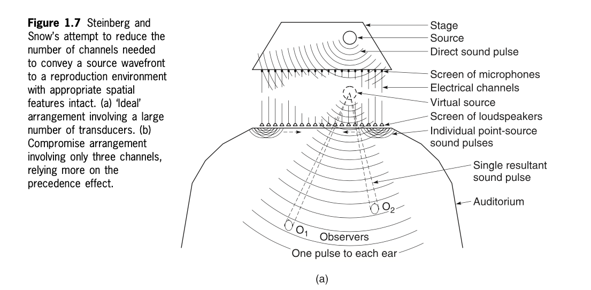
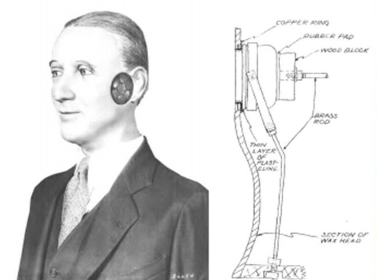
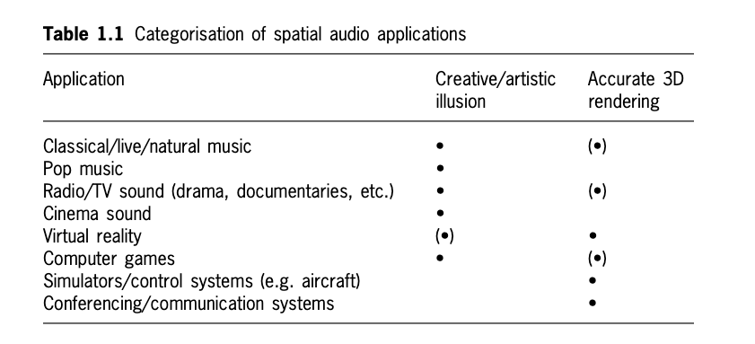

+++
title = "Introduction to Spatial Audio"
outputs = ["Reveal"]
[reveal_hugo]
margin = 0.2
+++

## Introduction to Spatial Audio

---

## The Spatial Dimension in Natural Sound

* Width: left ↔ right placement of sounds
* Height: perception of vertical position
* Depth: distance and front-to-back layering

{}

* Humans naturally experience sound in three dimensions, even with just two ears.
* Spatial hearing helps us orient ourselves and understand our environment.
* Natural sound perception involves cues such as:

  * **Location** (where a sound is coming from in space)
  * **Size** (how large or diffuse the source seems, often less consciously noticed than with vision)
  * **Distance** (how far away the source is, linked to loudness and reverberation)
* Sound is especially critical for detecting events behind us or above us, where vision provides little information.

{}

---

## Natural Sound in Outdoor Environments

* Multiple sound sources with unique locations and qualities
* Natural blending creates a diffuse soundscape
* Contrast between background ambience and identifiable events

{}

* Outdoor environments often feel **spacious** because sound arrives from many directions.
* Sources overlap and blend, creating a diffuse sound field.
* Examples of blended **background ambience**: wind, distant traffic, flowing water.
* Examples of **localizable sources**: birds, footsteps, voices.
* This balance between diffuse ambience and distinct signals shapes the **“outdoor” perception**—open, external, and less confined compared to indoor spaces.
* Our brains rely on this mixture to recognize environments and feel oriented in space.

{}

---

## Natural Sound in Indoor Environments

* Reflections shape how sound is perceived
* Reflections reveal size and character of the space
* Contrast between direct and reflected sound is key

{}

* Indoor soundscapes are dominated by **reflections from walls, ceilings, and floors**.
* These reflections provide critical spatial information:

  * **Room size** (longer delay = larger space).
  * **Room shape and surface qualities** (sharp vs. diffuse echoes).
* The brain compares **direct sound** (arriving first) with **reflected sound** (arriving later) to understand where we are and how large the space feels.
* Too many reflections can blur clarity, while carefully managed reflections can add warmth and fullness (as in concert halls).
* Unlike outdoors, where sound dissipates, indoors the boundaries of the room constantly reinforce and reshape what we hear.

{}

---

## Guess the Environment?

<audio src="cistern.wav" controls></audio>

{}

- Recorded inside an old cistern.
- Echoes and reverberation suggest a closed, reflective space.

{}

---

## Guess the Environment?

<audio src="sea-cave.wav" controls></audio>

{}

- Recorded in a sea cave.
- Reverberations from waves and dripping water suggest an enclosed, natural space.

{}

---

## Guess the Environment?

<audio src="forest-birds.mp3" controls></audio>

{}

- Recorded in a forest with birds and wind.
- Open, natural sound with identifiable bird calls suggests an outdoor environment.

{}

---

## Guess the Environment?

<audio src="bathroom-fan.wav" controls></audio>

{}

- Recorded with a bathroom fan.
- The mechanical sound and enclosed reverberation suggest an indoor, small reflective space.

{}

---

## Guess the Environment?

<audio src="cricket.wav" controls></audio>

{}

- Recorded in the Californian desert, featuring a cricket.
- The clear, isolated sound suggests an open outdoor space with little environmental noise.

{}

---

## Sound Intensity in a Free Field

{}

The key concept is the **inverse-square law**: as sound radiates outward from a source, its intensity decreases with the square of the distance.

## Omnidirectional Radiation

Imagine a sound source that radiates equally in every direction—what we call an **omnidirectional source**.

* The sound energy spreads out spherically, like ripples on a pond, but in 3D.
* The power of the source is represented as **W** (watts).
* As this energy moves outward, it must cover more and more surface area.

Ask students: *If the same amount of power is spread over a larger area, what happens to the intensity?*

## Surface Area and Intensity

The surface area of a sphere increases as we move farther away from the source:

* Formula: **S = 4πr²**.
* Intensity is defined as **Power ÷ Area**, so:
  **I = W / (4πr²)**.

This means intensity doesn’t decrease linearly with distance—it decreases much faster, with the square of distance.

Analogy: Think about butter spread over bread. If the bread is small, the butter layer is thick. If the bread is twice as large, the same butter covers it more thinly. The “flavor” (intensity) weakens.

## Doubling Distance Effect

Now, here’s the important rule of thumb:

* At distance **r**, a patch of energy covers 1 m².
* At distance **2r**, that same energy must now cover 4 m².
* So, intensity is reduced to **one-quarter**.

In sound terms, this is about a **6 dB drop** every time you double the distance.

Ask students: *If we start at 1 meter from the source, how many dB lower will it sound at 4 meters?*
(Answer: 12 dB lower, since doubling twice = two 6 dB drops.)

## Visual Explanation of the Diagrams

(a) **Spherical Model**

* A sphere radiates outward from the source.
* Energy that passes through a 1 m² patch at distance r spreads thinner as the sphere expands.

(b) **Expansion Model**

* The cube-like sketch shows how a fixed energy beam expands from 1 m² at r to 4 m² at 2r.
* It illustrates the same inverse-square relationship in a more geometric way.

## Key Takeaways

* Sound intensity decreases with the **inverse-square of distance**.
* Doubling distance reduces intensity to **one-quarter**.
* In decibels, every doubling of distance equals a **6 dB drop**.
* This principle is essential in live sound, recording, and acoustic design.

Final question for students: *How might this principle affect microphone placement in a concert recording?*

**Answer**

When placing microphones for a concert, the **inverse-square law** means that distance has a dramatic effect on the captured level:

* **Closer placement**: If the microphone is close to the source, the captured sound will be much louder and more direct. This reduces the influence of room acoustics and ambient noise. That’s why close-miking is common for individual instruments.

* **Further placement**: As you move the microphone farther away, intensity drops quickly. For every doubling of distance, the level decreases by **6 dB**. This means distant microphones require more gain, which can also bring up background noise.

* **Balance of direct vs. ambient sound**: Engineers often combine close mics (for clarity) with distant or overhead mics (to capture the natural reverb and ensemble blend). The inverse-square law helps explain why the distant mics sound quieter and more diffuse—they’re catching less direct energy and more reflections.

* **Practical implication**: If you double the mic’s distance from a violinist—from 1 m to 2 m—you don’t just lose a little volume, you lose a **quarter of the intensity**. That affects both loudness balance and the clarity of the recording.

{}

---

## Sound Directivity

{}

## Directivity Patterns of Sound Sources

* Diagram shows how much energy a source radiates at different angles.
* Radiation is **not uniform**: more energy is radiated to the front (0° axis).
* Directivity increases with **frequency**.

### Key Observations

* **LF (Low Frequency, solid line)**

  * Radiation pattern is broader and more rounded.
  * Energy spreads more evenly around the source.
  * Less directional.

* **HF (High Frequency, dash-dot line)**

  * Pattern is narrower and elongated forward.
  * Strong emphasis on the 0° axis.
  * Much less energy radiated to the sides (90°/270°) or back (180°).
  * More directional.

### Acoustic Meaning

* At **low frequencies**, sound wraps around obstacles and radiates almost omnidirectionally.
* At **high frequencies**, sound beams forward, creating a focused projection.
* This is why bass feels “everywhere” in a room, but treble seems more localized.

### Applications

* **Microphone pickup patterns** work on the same principle (e.g., cardioid polar plots).
* **Loudspeaker design** uses directivity to control coverage in a venue.
* In **recording and live sound**, understanding directivity helps with mic placement, avoiding bleed, and controlling reflections.

{}

---

### Real-World Examples of Directivity Patterns

[Adam Audio Speaker Directivity Chart](https://www.adam-audio.com/blog/understanding-speaker-directivity-charts/)

{}

What the plot shows

* X-axis: frequency (kHz), \~0.1–20 on a log scale.
* Y-axis: vertical angle relative to the tweeter axis (0°), from −180° to +180°.
* Color: level in dB relative to 0° (warm colors ≈ louder; cool colors ≈ attenuated).

How to read it

* Low frequencies (≤ \~300–500 Hz): wide “orange” band across many angles → near-omnidirectional vertically.
* Midband (\~1–3 kHz): pattern begins to pinch; alternating yellow/green bands indicate vertical lobing around the crossover region.
* High frequencies (≥ \~5–10 kHz): narrow orange core centered at 0° with rapid falloff to green/blue → small vertical sweet spot.

Approximate landmarks (read from color transitions)

* Around 1 kHz: useful coverage to roughly ±60° before substantial roll-off.
* Around 5 kHz: useful coverage tightens to roughly ±30°.
* ≥10 kHz: useful coverage can be as tight as ±15–20° (levels drop quickly away from 0°).

Why it matters

* Ear height: align ears close to the tweeter’s 0° axis to keep HF balance.
* Tilt: angle monitors so the 0° axis meets the listener’s ears; small up/down moves can change brightness.
* Reflections: desk and ceiling paths are typically off-axis vertically; their HF content is reduced relative to direct sound, but midband lobing can color those reflections.
* Placement decisions: for multiple listeners or standing positions, consider stands/tilt to keep everyone within the HF coverage; for a single mix position, aim precisely at ear height.
* Design angle: waveguides/horns and coaxial drivers are used to control or stabilize this pattern, trading width for consistency.

Prompt for discussion

* If a listener stands up 20–30 cm, which frequency range changes most audibly, and why?
* How would you adjust speaker tilt or seat height to keep the spectral balance stable across sessions?

{}

---

### Real-World Example: Tuba Directivity

{}

Reading the figure

* Left: measurement array of microphones around the tuba at four elevation rings (about +53°, +11°, −11°, −53°).
* Right: four heatmaps (one per elevation).

  * X-axis: frequency (≈63 Hz to 8 kHz).
  * Y-axis: azimuth angle at that elevation (−180° to +180°, front at 0°).
  * Color/gray scale: level relative to the on-axis reference (0 dB = loudest), down to about −60 dB.
* The plot is normalized, so it shows relative level vs. direction rather than absolute SPL.

What it shows

* 63–250 Hz: broad, near-omnidirectional radiation at all angles; the instrument body radiates, so bell aim matters less.
* 500 Hz–2 kHz: pattern begins to concentrate toward the bell; side and rear levels fall by \~10–20 dB depending on elevation.
* > 2–4 kHz: strong beaming along the bell axis (forward and slightly upward), with steep roll-off to the sides and rear (often >20–30 dB down).
* Elevation asymmetry: upper rings show more HF energy than lower rings, consistent with the bell pointing upward/forward.

Practical implications

* Mic placement for clarity/brightness: aim near the bell axis (slightly above and in front) to capture mid/high partials and articulation.
* Warmer, rounder tone: move off-axis toward the side of the bell or lower elevation to reduce HF beaming and key/valve noise.
* Section balance and seating: players and listeners above/forward of the bell hear more definition; those off to the side/rear perceive less brightness.
* Live sound: a single overhead or front-of-bell mic will translate articulation; add a side or room mic to recover body and low-end bloom.
* Recording consistency: mark bell aim and mic height—small vertical changes can shift HF capture noticeably.

Prompts for discussion

* If you want more articulation without boosting EQ, which direction should you move the mic, and why?
* How might this pattern inform the placement of baffles or reflectors in a live hall to improve clarity without making the sound harsh?

{}

---

### Sources in Reflective Spaces

{}

Reading the room

* Reflective boundaries (walls, floor, ceiling, furniture) return sound to the listener along multiple paths.
* The listener hears:

  * Direct sound first (most intelligible cues).
  * Early reflections shortly after, from nearby surfaces—these can widen the image or blur localization depending on timing and level.
  * A dense reverberation tail that builds an ambient, enveloping field.

Perception and practice

* Strong, close-in reflections reduce directional clarity; controlling them improves intelligibility and imaging.
* Diffusion and absorption let you tune the mix of clarity (direct/early) and spaciousness (late/reverb).
* For teaching demos: toggle between a dry signal, early-reflection simulation, and late reverb to let students hear how localization and “room size” change.

{}

---

### Introduction to Spatial Reproduction of Sound

* Two aims: recreate real acoustic spaces or design imagined spaces
* Three approaches: channel-based (stereo, 5.1), object-based (e.g., Atmos), scene-based (Ambisonics/HOA)
* Two delivery modes: loudspeakers (room-interactive) and headphones/binaural (HRTF-based)

{}

Overview

* Recreate natural environments: capture or model real spaces (e.g., concert hall impulse responses, Decca Tree, or 5.1 per ITU-R BS.775). The goal is plausibility and fidelity to the original venue. ([ITU][1], [AES][2])
* Create virtual environments: place and move sounds anywhere in 3D, independent of an original space (film, games, XR).

Core paradigms

* Channel-based: fixed speaker feeds; phantom imaging between loudspeakers. ITU-R BS.775 defines reference angles for 5.1 layouts used in production/playback. ([ITU][1], [AES][2])
* Object-based: each element carries position metadata; a renderer adapts playback to any certified layout (e.g., Atmos). ([professional.dolby.com][3], [Audient][4])
* Scene-based (Ambisonics/HOA): encode the sound field with spherical harmonics; decode to speakers or to binaural. ([Microsoft][5], [Wikipedia][6])

Delivery and perception

* Loudspeakers: listener hears direct sound plus room interactions; layout and room treatment shape localization, envelopment, and timbre. ITU reference layouts provide a consistent baseline. ([ITU][1])
* Headphones/binaural: HRTFs and head-tracking maintain externalization and stable localization as the head moves. ([MathWorks][7], [MDPI][8])

Evaluation criteria (use when comparing systems in class)

* Localization accuracy and stability with listener movement
* Externalization vs. “in-head” sensation
* Envelopment and spatial resolution
* Spectral fidelity (no excessive coloration)

Teaching prompts

* When would you choose object-based over channel-based for a touring show?
* How does head-tracking improve externalization in VR compared to static binaural?

{}

---

## Early Sound Reproducing Equipment

{}

- Early sound reproduction was monophonic (one channel only).
- Only basic spatial cues, such as depth from reverberation, were present.
- The first gramophones and phonographs from the 1800s and early 1900s paved the way for later advancements in spatial audio.

{}

---

## The Théâtrophone: An Early Stereo Transmission

{}

- **Clement Ader’s 1881 Experiment**:
  - An early example of stereophonic sound transmission.
  - Telephone pickups were placed in the footlights of the Paris Opera and connected to receivers.
  - Visitors at the 1881 Paris Exhibition could listen to live opera performances with a sense of spatial realism.
  
- **Significance**:
  - Although commercial stereophonic reproduction didn’t emerge until much later, this experiment laid the groundwork for future audio transmission technology.
  - It demonstrated how sound could be spatially transmitted and experienced remotely, an early precursor to modern stereo and surround sound systems.
{}

---

## Bell Labs in the 1930s

{}

## Speaker Notes

* This diagram shows an early experiment in spatial sound reproduction by **Steinberg and Snow** at Bell Labs in the 1930s.
* Their question: *How many channels are needed to reproduce the spatial impression of a real source on stage for an audience?*

### Step 1: The “Ideal” Concept

* Imagine a **screen of microphones** in front of the stage, each capturing the wavefront at a slightly different position.
* Each mic feeds a **matching loudspeaker screen** in the auditorium.
* Together, the loudspeakers recreate the original **sound wavefront**—so every listener perceives the correct direction and timing, no matter where they sit.
* In theory, this is perfect wavefield reproduction, but it requires a **huge number of transducers**.

### Step 2: The Compromise

* Steinberg & Snow realized you could get most of the effect with far fewer channels.
* By using just **three channels (Left–Center–Right)**, you can still create a stable sound image for a wide audience.
* This works because of the **precedence effect**: our ears lock onto the **first-arriving sound** to determine direction. Later arrivals reinforce loudness without shifting localization.

### Why It Matters

* Their work laid the foundation for **cinema LCR playback systems**, later evolving into stereo and surround.
* It also framed two continuing approaches in spatial audio:

  1. **Wavefront reconstruction** (many sources, physical accuracy).
  2. **Psychoacoustic rendering** (few sources, exploiting how humans localize).

### Teaching Prompt

* You might ask students: *Why does the center channel help stabilize the image compared to stereo?*
* Or demonstrate with clicks through two vs. three speakers—listeners off to the side will notice the center channel keeps the image anchored.

{}

---

## Binaural Recording

{}
- **What is Binaural Recording?**
  - Binaural stereo aims to recreate the experience of listening with two human ears.
  - Uses microphones positioned at ear-level to simulate natural human hearing.
  - When reproduced through headphones, binaural recordings create a highly realistic spatial experience.

- **Diagram Explanation**:
  - **Left Side**: Early model of a binaural head used for binaural recordings, designed to simulate how humans perceive sound directionally.
  - **Right Side**: Cross-section showing internal components:
    - **Copper Ring, Rubber Pad, Wood Block**: Elements that simulate the density and sound-blocking characteristics of the human head.
    - **Brass Rod and Thin Layer of Plastic**: Components that mimic sound transmission through the human ear.
    - **Wax Head**: Designed to replicate the acoustic properties of a real human head and ears, providing realistic spatial audio cues.

- **Key Concepts**:
  - Binaural recordings rely on the **subtle timing and amplitude differences** between the two "ears" to recreate spatial realism.
  - When played back through headphones, they provide a sense of directionality—front, back, above, below—similar to natural hearing.
  - This method is especially effective in applications such as **virtual reality (VR)**, **gaming**, and **immersive audio**.

### Historical Background:
- **Who Made It?**: This particular binaural head was pioneered by **Harvey Fletcher** and **Bell Laboratories** in the **1930s**.
- **When?**: The concept of binaural recording dates back to the **late 19th century**, but modern implementations, like this one, became more prominent in the 1930s. Fletcher’s work at Bell Labs greatly contributed to advancing this technique, allowing for the development of immersive 3D sound experiences.

{}

---

## Ambisonics

- **Developed in the 1970s**
- **360° Sound Field** (Including height)
- **Key Contributors**: Peter Fellgett & Michael Gerzon
- **Applications**: Virtual reality, immersive audio

For more, visit: [History of Ambisonics](https://intothesoundfield.music.ox.ac.uk/ambisonics)

{}

- Ambisonics was a revolutionary approach to surround sound, developed in the 1970s.
- Unlike quadraphonic systems, which had limitations, Ambisonics used a more sophisticated **psycho-acoustic approach** to deliver immersive sound.
- The **Soundfield microphone** was a key innovation, capturing sound from all directions to recreate an accurate 360° audio experience.
- This system set the groundwork for modern applications, including virtual reality and immersive audio environments.

{}

---

## The Home Cinema and ITU-Standard Surround Sound

{}

- Surround sound systems are now standard for home cinemas.
- Adding multiple channels allows for an immersive experience in everyday spaces.
- ITU-standard surround sound offers high-quality spatial reproduction for both film and music.

{}

---

## Applications of Spatial Audio

{}

- Applications for spatial audio include:
  - Film and game sound.
  - Music production and playback.
  - Virtual reality and immersive environments.
  - Teleconferencing and remote collaboration.
- Spatial audio is used both for recreating real environments and creating entirely new virtual spaces.

{}

---

- **Military Communication**: Enhances situational awareness in combat by spatializing voices, reducing cognitive overload.  
  Example: [Spatial Audio in Tactical Communication](https://www.armadainternational.com/2023/10/the-voices-in-my-head-spatial-audio-a-game-changer-in-tactical-communication/)
- **Teleconferencing**: Improves clarity and reduces fatigue in multi-participant remote meetings by spatializing voices.  
  Example: [Spatial Audio in Remote Conferencing](https://hear360.io/news/enhance-remote-conferencing)
- **Education**: Enhances learning experiences through spatial audio in immersive virtual environments.  
  Example: [Spatial Audio for Education](https://ericasouthgateonline.wordpress.com/2021/04/22/spatial-audio-for-education/)
- **Therapy and Stress Reduction**: Used to reduce stress and anxiety in clinical and non-clinical populations.  
  Example: [Spatial Audio for Stress Reduction](https://journals.sagepub.com/doi/pdf/10.1177/2059204321993992)

