+++
title = "Stereo microphone techniques"
outputs = ["Reveal"]
[reveal_hugo]
margin = 0.2
custom_css = "css/recording-stereo.css"
+++



# Stereo microphone techniques

{}
50-minute plan: goals and recall, 5 minutes; XY and Blumlein, 10; near-coincident and AB, 12; M/S, 10; Decca Tree, 3; pair task and exit check, 10. Use short excerpts. If time is tight, assign the additional listening as follow-up.
{}

---

## Today’s goals

- Predict how angle and spacing affect the stereo image.
- Choose an array for a source and room, and explain the tradeoff.
- Decode M/S and check a stereo recording in mono.

---

## Microphone arrays

- Two microphones can capture a stereo scene.
- Matched pairs help XY, Blumlein, ORTF and AB stay balanced.
- Measure capsule spacing and the angle between microphones.
- M/S uses complementary patterns. Decca Tree uses three mics.

---

## Recall: stereo cues

What changes between channels when we separate the capsules?

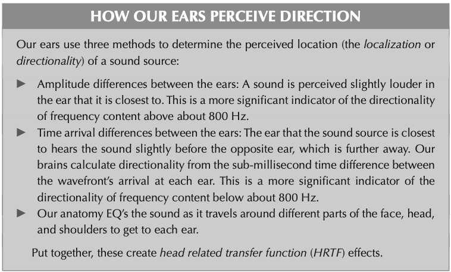

---

## XY coincident pair

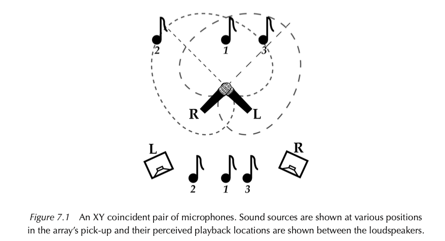
<ul>
<li>Capsules sit nearly together, minimizing arrival-time differences.</li>
<li>Angled directional patterns create level differences between channels.</li>
</ul>

{}
Distinguish interchannel differences at the microphones from differences between a listener's ears. Ask students to predict the mono result from the capsule placement.

- XY Coincident Pair Techniques involve the use of two cardioid or hyper-cardioid microphones.
- The microphones are positioned closely together, with their capsules as close as possible.
- They are angled between 90° to 130° apart, with their pick-up patterns crossing in front of the sound source.
- The entire microphone array is aimed at the center of the sound source.
- Each microphone is positioned 45° to 65° off-axis from pointing directly forward.
- Sound source 1 originates from the center of the source and is equidistant and equally off-axis from both microphones.
- This results in both microphones picking up identical sound simultaneously.
- When the microphone signals are panned hard left and hard right on a stereo loudspeaker system, both loudspeakers reproduce the same sound simultaneously.
- Identical direct sound and inter-aural crosstalk reach each of the listener's ears, creating a phantom center image precisely between the loudspeakers.
{}

---

## XY: width and mono

- Capsule angle and polar pattern shape the image width.
- XY often gives a compact image and reliable mono playback.
- Off-axis tone depends on the microphones and source position.

What would you change if the image were too narrow?

{}
A wider included angle can spread the image for a fixed source layout. XY is not inherently muddy, and absence of spacing is not the sole determinant of width. Coincidence minimizes spacing-related comb filtering in mono, but microphone mismatch, reflections and imperfect placement still matter. Check the actual recording.

Reference: https://www.dpamicrophones.com/mic-university/audio-production/stereo-recording-techniques-and-setups/
{}

---

## Listen: XY

Where do the drums sit? Which image is wider?

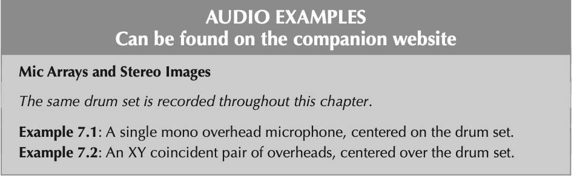

Example 7.1<audio controls preload="none" aria-labelledby="example-7-1" src="https://s3-eu-west-1.amazonaws.com/s3-euw1-ap-pe-ws4-cws-documents.ri-prod/9780367470364/mp3/7.1.mp3"><a href="https://s3-eu-west-1.amazonaws.com/s3-euw1-ap-pe-ws4-cws-documents.ri-prod/9780367470364/mp3/7.1.mp3">Play example 7.1</a></audio>

Example 7.2<audio controls preload="none" aria-labelledby="example-7-2" src="https://s3-eu-west-1.amazonaws.com/s3-euw1-ap-pe-ws4-cws-documents.ri-prod/9780367470364/mp3/7.2.mp3"><a href="https://s3-eu-west-1.amazonaws.com/s3-euw1-ap-pe-ws4-cws-documents.ri-prod/9780367470364/mp3/7.2.mp3">Play example 7.2</a></audio>

[*Mic It!* companion audio, Chapter 7](https://routledgetextbooks.com/textbooks/9780367470364/audio_files.php)

{}
Play examples 7.1 and 7.2. Keep playback level comparable and use the same listening position. Ask for an observation before asking for a preference. The examples may differ in placement or source, so avoid attributing every difference to the array alone. For a mono check, sum L and R and compare tone and source balance as well as width.
{}

---

## Blumlein pair

Two figure-eight mics, coincident and crossed at 90°.

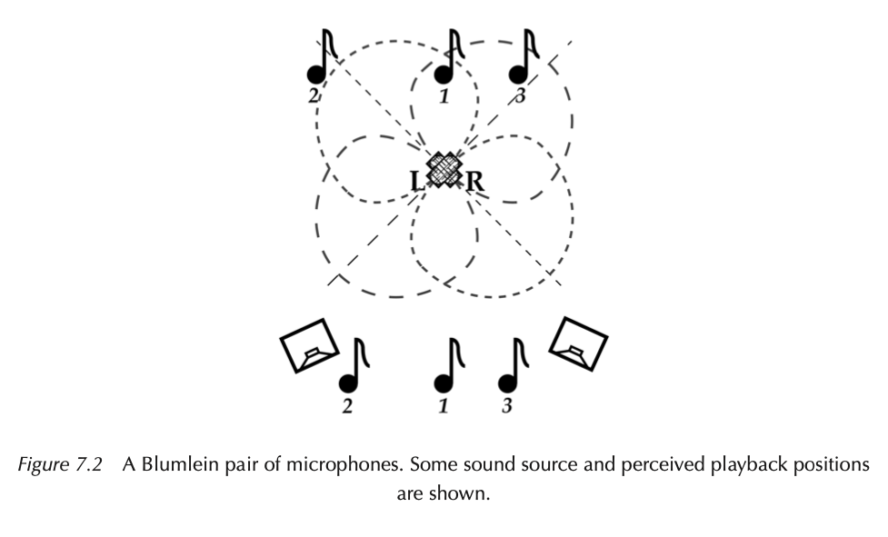

{}
A Blumlein pair is a coincident array of bidirectional microphones crossed at 90°. Each mic is displaced 45° from the center of the sound source,

This array works similarly to an XY coincident pair – it is a coincident pair. There are no time arrival differences between the coincident capsules, so as with XY coincident pair techniques, **only amplitude difference information is recorded and reproduced on playback.**

The side rejection of bidirectional mic patterns causes less common pickup between the mics. This can create natural, realistic images that are wider and more spacious than XY.

The sound picked up from behind the microphone can also add naturalness because of the room reflections it picks up.
{}

---

## Listen: Blumlein

How does the room sound compare with XY?

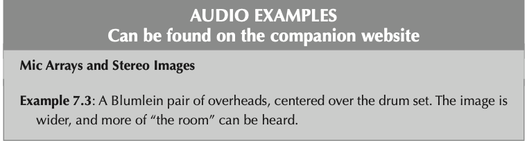

Example 7.3<audio controls preload="none" aria-labelledby="example-7-3" src="https://s3-eu-west-1.amazonaws.com/s3-euw1-ap-pe-ws4-cws-documents.ri-prod/9780367470364/mp3/7.3.mp3"><a href="https://s3-eu-west-1.amazonaws.com/s3-euw1-ap-pe-ws4-cws-documents.ri-prod/9780367470364/mp3/7.3.mp3">Play example 7.3</a></audio>

[*Mic It!* companion audio, Chapter 7](https://routledgetextbooks.com/textbooks/9780367470364/audio_files.php)

{}
Play examples 7.3. Keep playback level comparable and use the same listening position. Ask for an observation before asking for a preference. The examples may differ in placement or source, so avoid attributing every difference to the array alone. For a mono check, sum L and R and compare tone and source balance as well as width.
{}

---

## Near-coincident pairs

Spacing adds arrival-time differences to level differences.

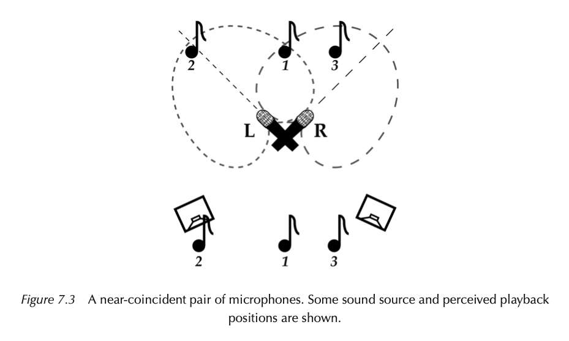

{}
ORTF, NOS and DIN use angled cardioid microphones with separated capsules. The combination of spacing, angle, source distance and source width determines the reproduced image. They often offer more spaciousness than XY, with a greater chance of tonal changes in a mono sum. Avoid treating any technique as automatically clearer or better. Listen in mono before committing to placement.
{}

---

## ORTF, NOS and DIN

ORTF: 17 cm / 110° · NOS: 30 cm / 90° · DIN: 20 cm / 90°

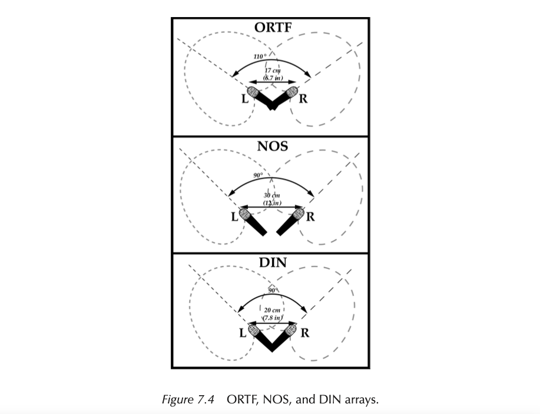

{}
**ORTF Technique:**
- Developed by the Office de Radiodiffusion-Télévision Français (ORTF).
- Utilizes two cardioid microphones.
- Microphones are set at an angle of 110°.
- Capsules are spaced 17 cm (6.7 in) apart, which is similar to the spacing of human ears.
- Produces a satisfying, transparent stereo image.
- Offers relatively good mono compatibility.

**NOS Technique:**
- Developed by Netherlands Radio (NOS).
- Employs two cardioid microphones.
- Microphones are set at a 90° angle to each other.
- Capsules are spaced 30 cm (12 in) apart, wider than ORTF.
- Mono compatibility may not be as assured as with ORTF due to wider spacing.
- Provides a slightly bigger and more immersive stereo image compared to ORTF.
- Narrower angle of incidence between the microphones reduces off-axis pickup.

**DIN Technique:**
- Standardized by the German Deutsches Institut Für Normung (DIN).
- Uses two cardioid microphones.
- Microphones are positioned 20 cm (7.8 in) apart.
- Set at an angle of 90°.
- Microphones are not as off-axis as in an ORTF array but are spaced further apart than ORTF.
- Provides a good balance of time arrival and amplitude differences.
- Particularly effective at shorter distances.
{}

---

## Listen: ORTF, NOS and DIN

Which has the clearest center? What changes in width?

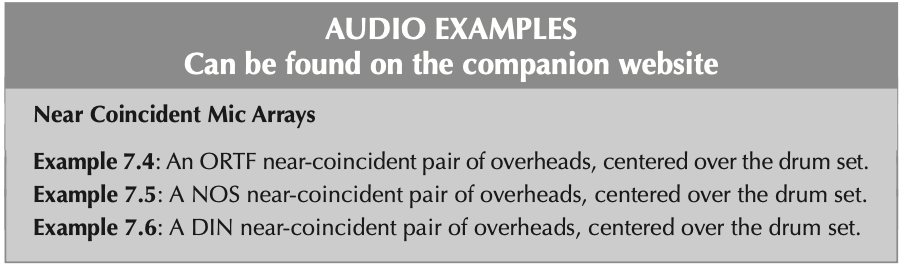

Example 7.4<audio controls preload="none" aria-labelledby="example-7-4" src="https://s3-eu-west-1.amazonaws.com/s3-euw1-ap-pe-ws4-cws-documents.ri-prod/9780367470364/mp3/7.4.mp3"><a href="https://s3-eu-west-1.amazonaws.com/s3-euw1-ap-pe-ws4-cws-documents.ri-prod/9780367470364/mp3/7.4.mp3">Play example 7.4</a></audio>

Example 7.5<audio controls preload="none" aria-labelledby="example-7-5" src="https://s3-eu-west-1.amazonaws.com/s3-euw1-ap-pe-ws4-cws-documents.ri-prod/9780367470364/mp3/7.5.mp3"><a href="https://s3-eu-west-1.amazonaws.com/s3-euw1-ap-pe-ws4-cws-documents.ri-prod/9780367470364/mp3/7.5.mp3">Play example 7.5</a></audio>

Example 7.6<audio controls preload="none" aria-labelledby="example-7-6" src="https://s3-eu-west-1.amazonaws.com/s3-euw1-ap-pe-ws4-cws-documents.ri-prod/9780367470364/mp3/7.6.mp3"><a href="https://s3-eu-west-1.amazonaws.com/s3-euw1-ap-pe-ws4-cws-documents.ri-prod/9780367470364/mp3/7.6.mp3">Play example 7.6</a></audio>

[*Mic It!* companion audio, Chapter 7](https://routledgetextbooks.com/textbooks/9780367470364/audio_files.php)

{}
Play examples 7.4–7.6. Keep playback level comparable and use the same listening position. Ask for an observation before asking for a preference. The examples may differ in placement or source, so avoid attributing every difference to the array alone. For a mono check, sum L and R and compare tone and source balance as well as width.
{}

---

## Spaced pair, AB

Usually two omnis. Spacing creates arrival-time differences.

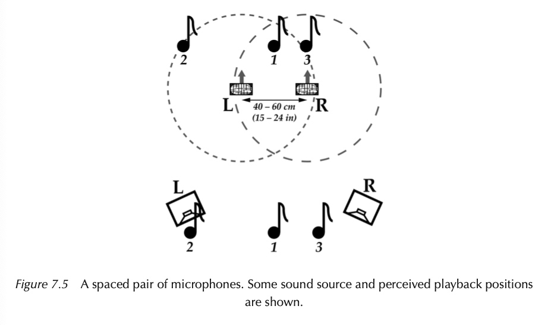

{}
Spacing is a choice, not a fixed recipe. Start with the source width, distance and room, then listen. At 50 cm spacing, the maximum path delay is about 0.50 / 343 = 1.46 ms. A centered source can still reach both mics simultaneously. Larger spacing can produce a spacious image or weaken the center. Sum to mono and listen for comb filtering and changes in source balance. Directional spaced pairs also introduce pattern-dependent level differences. More width is not necessarily a better image.

Reference: https://www.dpamicrophones.com/mic-university/audio-production/stereo-recording-techniques-and-setups/
{}

---

## Listen: Spaced pair

Does the center stay focused as the image widens?

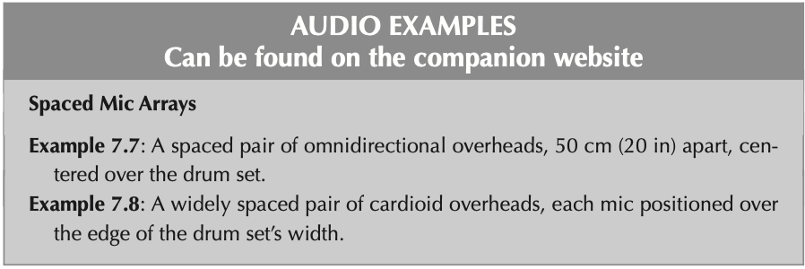

Example 7.7<audio controls preload="none" aria-labelledby="example-7-7" src="https://s3-eu-west-1.amazonaws.com/s3-euw1-ap-pe-ws4-cws-documents.ri-prod/9780367470364/mp3/7.7.mp3"><a href="https://s3-eu-west-1.amazonaws.com/s3-euw1-ap-pe-ws4-cws-documents.ri-prod/9780367470364/mp3/7.7.mp3">Play example 7.7</a></audio>

Example 7.8<audio controls preload="none" aria-labelledby="example-7-8" src="https://s3-eu-west-1.amazonaws.com/s3-euw1-ap-pe-ws4-cws-documents.ri-prod/9780367470364/mp3/7.8.mp3"><a href="https://s3-eu-west-1.amazonaws.com/s3-euw1-ap-pe-ws4-cws-documents.ri-prod/9780367470364/mp3/7.8.mp3">Play example 7.8</a></audio>

[*Mic It!* companion audio, Chapter 7](https://routledgetextbooks.com/textbooks/9780367470364/audio_files.php)

{}
Play examples 7.7 and 7.8. Keep playback level comparable and use the same listening position. Ask for an observation before asking for a preference. The examples may differ in placement or source, so avoid attributing every difference to the array alone. For a mono check, sum L and R and compare tone and source balance as well as width.
{}

---

## Mid-side, M/S

Mid faces forward. A figure-eight Side mic faces sideways.

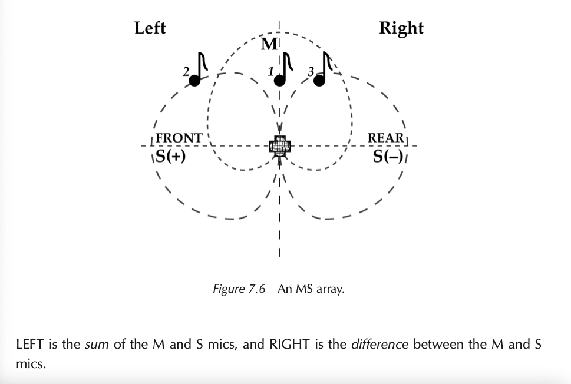

{}
- In stereo techniques discussed earlier, separate left and right microphones are used, and their signals are routed discretely to respective loudspeakers to create a wide stereo image.
- MS (Mid-Side) technique, as shown in Figure 7.6, is fundamentally different.
- MS doesn't capture left/right information in the traditional sense.
- MS employs a forward-facing microphone (typically cardioid but can be any polar pattern) to capture the center or middle (M) audio information.
- Additionally, it uses a bidirectional microphone oriented sideways at 90° to capture side (S) information, which combines sounds from both the left and right sides of the array.

{}

---

## M/S capsule placement

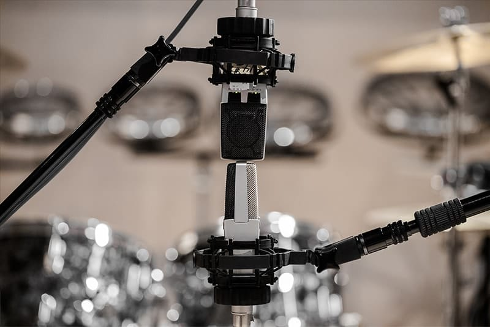

---

## M/S decoding

Left = Mid + Side 
Right = Mid − Side

- Send Mid equally to left and right.
- Add Side on the left and polarity-inverted Side on the right.
- Raise both Side feeds equally to increase width.

[REAPER routing reference: M/S Mastery](https://www.soundonsound.com/techniques/ms-mastery)

{}
These equations omit an optional common normalization gain. Leave headroom. Use one decoder only. For manual routing, send a mono Mid track equally to L/R, duplicate the mono Side signal, pan the copies hard L/R, invert polarity on the right copy, and link their gains. Confirm that a source on the left plays on the left. On summing, L + R = 2M, so Side cancels. The mono result retains Mid, not all the spatial information. Demonstrate by varying Side level, then switching to mono.
{}

---

## Listen: M/S

How do source width and room sound differ?

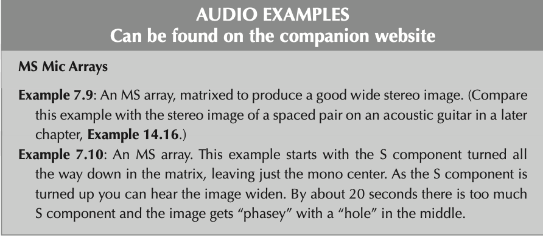

Example 7.9<audio controls preload="none" aria-labelledby="example-7-9" src="https://s3-eu-west-1.amazonaws.com/s3-euw1-ap-pe-ws4-cws-documents.ri-prod/9780367470364/mp3/7.9.mp3"><a href="https://s3-eu-west-1.amazonaws.com/s3-euw1-ap-pe-ws4-cws-documents.ri-prod/9780367470364/mp3/7.9.mp3">Play example 7.9</a></audio>

Example 7.10<audio controls preload="none" aria-labelledby="example-7-10" src="https://s3-eu-west-1.amazonaws.com/s3-euw1-ap-pe-ws4-cws-documents.ri-prod/9780367470364/mp3/7.10.mp3"><a href="https://s3-eu-west-1.amazonaws.com/s3-euw1-ap-pe-ws4-cws-documents.ri-prod/9780367470364/mp3/7.10.mp3">Play example 7.10</a></audio>

[*Mic It!* companion audio, Chapter 7](https://routledgetextbooks.com/textbooks/9780367470364/audio_files.php)

{}
Play examples 7.9 and 7.10. Keep playback level comparable and use the same listening position. Ask for an observation before asking for a preference. The examples may differ in placement or source, so avoid attributing every difference to the array alone. For a mono check, sum L and R and compare tone and source balance as well as width.
{}

---

## Decca Tree

Three spaced omnis feed left, center and right positions.

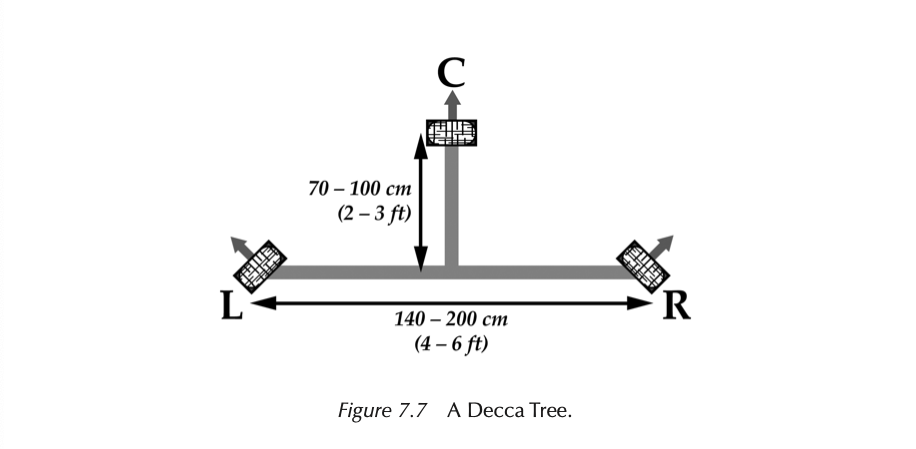

{}

The Decca Tree was originally developed by the Decca record label for orchestral recording, and can be heard on countless records and film soundtracks. It consists of three omni directional microphones, traditionally large diaphragm condensers, which are set up in a triangle as shown in Figure 7.7. The L mic is panned left, the R mic panned right, and the C mic panned to the center. The gains of the three mics should be set equally, although adjusting the C mic up or down can narrow or widen the perceived image.

{}

---

## Decca Tree in practice

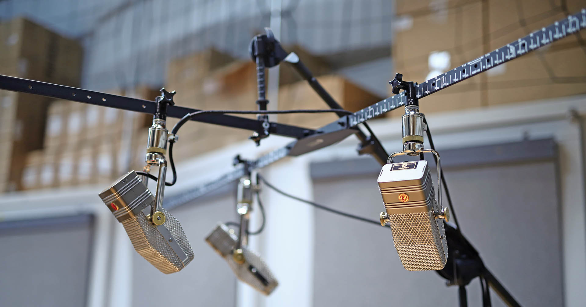

---

## Angle, spacing and image width

Compare the arrays. How do angle and spacing change the stereo image?

[Interactive stereo-array visualization](http://www.sengpielaudio.com/HejiaE.htm)

{}
Use this as a comparison after the technique examples. Begin with XY, then compare a near-coincident pair and a spaced pair. Ask students to predict the result before changing one variable at a time. The physical angle between microphones differs from the recording angle, the source sector mapped between the loudspeakers. The linked tool covers two-microphone systems, so use the preceding diagram to discuss Decca Tree separately. If the page is unavailable, revisit the array diagrams in this deck. Connect each observation to a placement choice for the pair task.
{}

---

## Pair task: choose an array

Record an acoustic duo in a small, reflective room. The mix also needs to work in mono.

1. Choose an array and sketch its placement.
2. Explain one advantage and one risk.
3. Name what you would listen for in a test take.

{}
Allow 2 minutes in pairs, then 3 minutes to compare answers. XY or M/S can be defensible starting choices when mono matters. ORTF can also be defended with a successful mono test. Ask how placement controls room pickup. Assess the reasoning and test plan, rather than requiring one correct array.
{}

---

## Exit check

- Why can capsule spacing change the tone of a mono sum?
- What remains when correctly decoded M/S is summed to mono?
- Your recording has a weak center. What would you try first?

{}
Expected answers: different arrival times cause frequency-dependent reinforcement and cancellation; Mid remains, with level depending on normalization; reduce excessive spacing or reconsider array distance/angle, then compare the result. Accept a testable adjustment supported by the student’s sketch. Use responses to decide whether the next session needs a brief mono-sum demonstration.
{}
