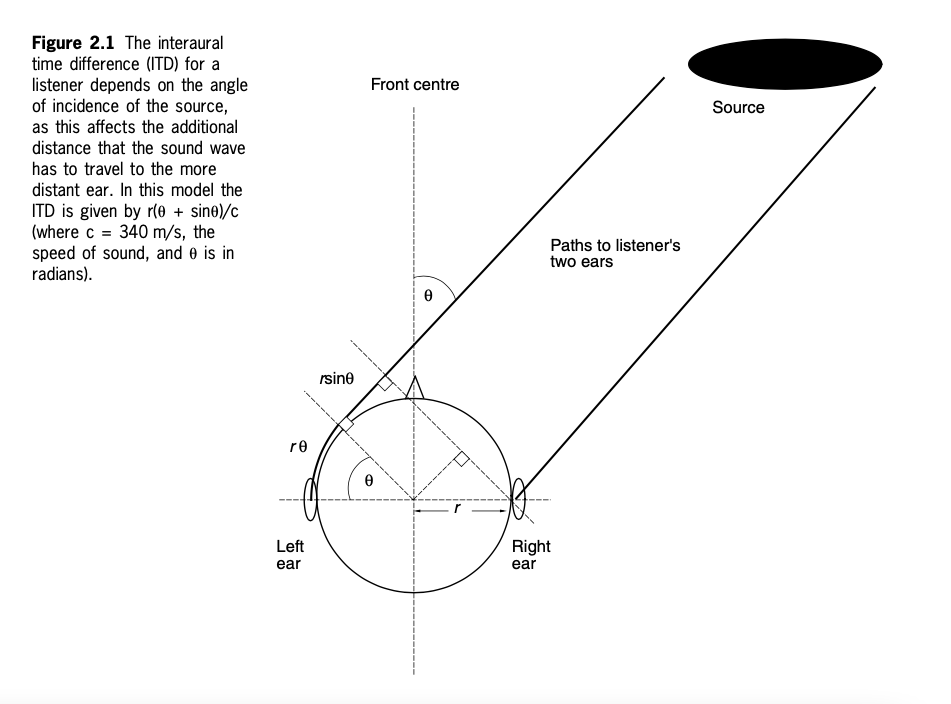
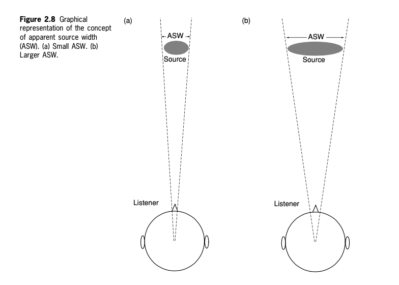
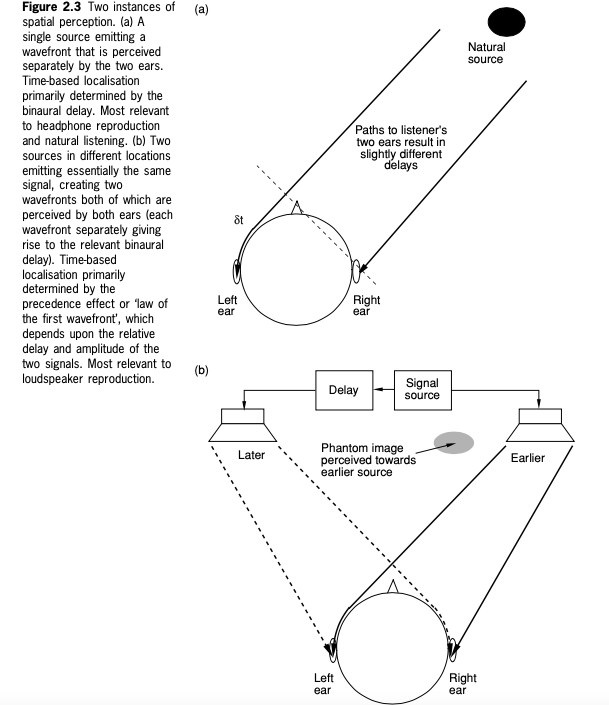
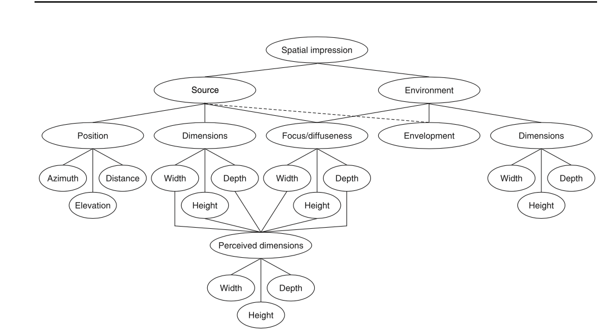

+++
title = "Spatial audio psychoacoustics"
outputs = ["Reveal"]
[reveal_hugo]
margin = 0.08
width = 1280
height = 720
custom_css = "css/spatial-psychoacoustics.css"
+++

# Spatial audio psychoacoustics

Direction, listening, and spatial impression

{}
Friday, September 11. Wednesday's distance-perception lesson addressed level, brightness, and direct-to-reverberant balance in mono. Today adds direction, individual listening differences, and vocabulary for evaluating a spatial image.

50-minute plan: goals and setup, 4 minutes; ITD and ILD with listening, 12; front/back ambiguity, HRTF comparison, and head movement, 14; precedence and selective attention, 8; spatial attributes and design task, 9; exit check, 3. Optional reference slides follow the exit check.

Course reference: Wenzel, Begault, and Godfroy-Cooper, “Perception of Spatial Sound,” in Roginska and Geluso, eds., Immersive Sound, chapter 1, 2017. Use the figures as illustrations; listener anatomy and stimuli affect numerical values.
{}

---

## From distance to direction

- Wednesday: make a mono source approach and recede
- Today: explain left/right and front/back impressions
- Next: use those observations in stereo and binaural work

{}
Retrieve one distance cue and its limitation. Then ask whether lowering a mono fader alone tells us which side a sound comes from. Expected answer: it changes level, not a left/right difference.

Keep the Mono Sound Walk mono for Monday, September 14. Today's headphone experiments prepare for later stereo reproduction and the Binaural / Stereo project; they do not change Project 1 requirements.
{}

---

## Listening setup

- Wear headphones with left and right correctly placed
- Use a comfortable level and pause between examples
- Turn off added spatial processing for cue-isolation demos

Report what you hear, including uncertainty.

{}
Turn off optional OS headphone spatialization or head tracking for these prerecorded cue-isolation comparisons. Do not disable hearing accommodations. Avoid playing multiple audio widgets at once.

Binaural recordings are intended to deliver separate signals to the ears. Loudspeaker crosstalk changes this condition. Students who cannot use headphones can predict changes and discuss peer observations. Differences in reports are useful evidence, not a hearing test.
{}

---

## Two differences between the ears

- **ITD:** interaural time difference
- **ILD:** interaural level difference

For a source on your right, which ear usually receives it first?

{}
Expected prediction: right ear first; it often also receives a higher level, especially at high frequencies. Keep timing and level separate. Use ILD consistently rather than switching to IAD.

These cues support horizontal localization, but neither uniquely identifies all directions. Spectral cues and movement follow later.

Reference: https://www.ncbi.nlm.nih.gov/books/NBK207834/
{}

---

## Interaural time difference

{}
Ask students to identify the near ear and trace the extra path to the far ear. The important idea is arrival-time difference, not memorizing the geometry.

For an adult head, the largest natural ITD is roughly 0.6–0.7 ms, depending on anatomy and model. The diagram's r is head radius, not ear-to-ear distance. The formula is retained in the optional reference section with its assumptions.

Reference: https://www.ncbi.nlm.nih.gov/books/NBK10820/
{}

---

## Listen: timing alone

Predict the direction, then describe the shift.

Timing example, 20 seconds<audio controls preload="metadata" src="IPO73-BinauralArrivalTime.wav" aria-label="Timing example, 20 seconds"><a href="IPO73-BinauralArrivalTime.wav">Open audio</a></audio>

Does the sound sit inside your head or outside it?

{}
Play once, collect reports, and replay if helpful. The supplied clip is labeled as an arrival-time demonstration. Do not assign angles to its positions without stimulus documentation.

Distinguish lateralization, a left/right image often inside the head on headphones, from an external source located in the surrounding world. A time difference alone need not produce externalization.

Optional controlled alternative: https://isle.hanover.edu/isle2/Ch11AudBrainLoc/Ch11InterTime.html . The illustration offers delay, frequency, and duration controls. Change delay while holding the other settings fixed.
{}

---

## Interaural level difference

- The head creates a frequency-dependent acoustic shadow
- The far ear usually receives less high-frequency energy
- Longer wavelengths diffract around the head more readily

ILD compares levels at the two ears.

{}
Avoid saying high frequencies are completely blocked or low frequencies pass unchanged. ILD is frequency-dependent and also depends on source geometry. Pinna filtering is a separate spectral-cue topic, not a synonym for ILD.

Reference: https://www.ncbi.nlm.nih.gov/books/NBK207834/
{}

---

## Listen: level difference

[Open the ISLE level-difference experiment](https://isle.hanover.edu/Ch11AudBrainLoc/Ch11InterLoud.html)

- Select the level-difference cue
- Compare a centered image with unequal ear levels
- Keep frequency and timing fixed

{}
Ask students to predict the perceived side before changing levels. Return to equal levels between comparisons. Collect “left,” “center,” “right,” or “unclear,” then ask whether the image feels external.

The ISLE page lists Level Difference and Time Difference cue selection. Use its Illustration tab. If the legacy interaction does not run, demonstrate an ordinary mono track's level pan through headphones at a comfortable level. This is a controlled channel-level comparison, not a complete HRTF simulation.

Source: https://isle.hanover.edu/Ch11AudBrainLoc/Ch11InterLoud.html
{}

---

## Frequency changes cue usefulness

- Low-frequency timing is useful for left/right judgments
- High-frequency level differences often contribute strongly
- Onsets and envelopes can also carry timing information

These are tendencies, not an absolute frequency split.

{}
The duplex account is a useful starting point. Fine-structure ITD sensitivity becomes limited at higher frequencies, but high-frequency sounds can carry envelope and onset timing cues. Do not teach “all low frequencies use only ITD, all high frequencies use only ILD.”

Reference: Wenzel et al., Immersive Sound, chapter 1. Related research: https://pmc.ncbi.nlm.nih.gov/articles/PMC3937989/
{}

---

## A timing ambiguity

A source in front and a source behind can produce similar ITD and ILD.

What additional information could distinguish them?

{}
Take predictions: outer-ear spectral filtering and changes during head movement are good answers. Explain that ITD/ILD alone leave front/back and elevation ambiguities. Introduce the cone of confusion verbally without using the former Coneheads poster as a scientific diagram.
{}

---

## Pinnae and spectral cues

The outer ear filters sound differently for different directions.

Patterns of peaks and notches help distinguish elevation and front from back.

{}
A listener learns direction-dependent spectral patterns. Avoid a universal rule that rear sounds are simply duller or that one fixed notch frequency determines height for everyone. The source spectrum and listener anatomy matter.

The head and torso also affect the signal at the ears. These direction-dependent responses are described by HRTFs on the next slide.

Reference: Wenzel et al., Immersive Sound, chapter 1.
{}

---

## Head-related transfer functions

An HRTF describes the acoustic filtering from a source to one ear.

A left/right pair captures timing, level, and spectral differences for a source position.

{}
HRTF stands for head-related transfer function. It describes an acoustic response, not a brain mechanism. The corresponding impulse response is an HRIR; binaural renderers can filter audio with a left/right pair.

Responses depend on the listener's anatomy and source position. Direction is central, and near-field distance can also matter. Reverb and the room are additional influences rather than automatically part of a free-field HRTF.

Reference: https://www.ncbi.nlm.nih.gov/books/NBK207834/
{}

---

## Compare three HRTFs

A: IRC 1002<audio controls preload="metadata" src="HRTF/IRC_1002_P345.wav" aria-label="A: IRC 1002"><a href="HRTF/IRC_1002_P345.wav">Open audio</a></audio>

B: IRC 1003<audio controls preload="metadata" src="HRTF/IRC_1003_P345.wav" aria-label="B: IRC 1003"><a href="HRTF/IRC_1003_P345.wav">Open audio</a></audio>

C: IRC 1004<audio controls preload="metadata" src="HRTF/IRC_1004_P345.wav" aria-label="C: IRC 1004"><a href="HRTF/IRC_1004_P345.wav">Open audio</a></audio>

Which gives the clearest position or strongest outside-the-head impression?

{}
Each supplied file is 12 seconds, stereo. Play one at a time at a fixed playback setting. Record perceived direction or movement, externalization, and any timbral change. Do not promise a particular trajectory or a correct front/back answer from the filenames.

Have partners compare reports before discussing individual differences. A short preference comparison is not a validated personal HRTF fitting procedure. The other three files are in the optional section.

Original collection: IRCAM LISTEN, http://recherche.ircam.fr/equipes/salles/listen/sounds.html . These course copies play locally; the archival page may be unavailable.
{}

---

## What the comparison tells us

- A shared render can produce different impressions
- Clear direction and externalization are separate judgments
- A preferred sample is a starting point for further testing

{}
Ask for one disagreement between listeners and one observation they agreed on. Separate changes in timbre from changes in location. Do not diagnose a listener or promise that a personalized HRTF always eliminates localization errors.

Connect this to testing future binaural mixes with more than one listener and documenting the playback setup.
{}

---

## Head movement adds evidence

With a real, stationary sound source, turn your head gently.

How do direction and timbre change?

A fixed headphone file usually moves with your head.

Optional loudspeaker source<audio controls preload="metadata" src="HighHum.wav" aria-label="Stationary loudspeaker sound, 21 seconds"><a href="HighHum.wav">Open audio</a></audio>

{}
Use a real fan or another stationary sound in the room. Alternatively play HighHum.wav from one stationary loudspeaker after students remove headphones. Let a few students turn their heads gently while keeping their position fixed.

Do not run this as a headphone head-turn test. A fixed binaural recording does not update its ear signals in response to motion. A head-tracked renderer can update the source-to-head direction to maintain a world-fixed virtual source.

Optional sound source: [HighHum.wav](HighHum.wav). Moving the head changes the relative source direction; the HRTF is not an anatomical filter that spontaneously changes shape.
{}

---

## First arrivals and reflections

A direct sound may be followed by similar reflected sound.

We often hear one event located toward the first arrival.

This is the precedence effect.

{}
Distinguish fusion, hearing one event, from localization dominance, locating toward the lead. At larger delays the lag may be heard separately. The outcome depends on signal, delay, level, and context; there is no universal echo threshold.

ITD concerns the difference between ears. Precedence concerns the perceptual treatment of leading and lagging sound events. It occurs in natural rooms and can be studied with speakers or headphones.

Research: https://pmc.ncbi.nlm.nih.gov/articles/PMC4310855/ . The comparison diagram is in the optional section.
{}

---

## Following one voice

Choose a voice to follow. What helps you keep track of it?

Speech comparison, 16 seconds<audio controls preload="metadata" src="Cocktail_Party_Effect.wav" aria-label="Speech comparison, 16 seconds"><a href="Cocktail_Party_Effect.wav">Open audio</a></audio>

{}
Ask students to report whether spatial separation helps and what else they use: voice quality, pitch, rhythm, language, and attention. Location is one cue, not the sole basis of the cocktail-party effect. Two voices at one location need not be grouped as one source.

The supplied clip is labeled as a mono/stereo comparison. Describe the audible change rather than assigning undocumented processing parameters. The second speech file is optional reference material.

Reference: Wenzel et al., Immersive Sound, chapter 1.
{}

---

## Seeing can influence hearing

A visible speaker can pull the apparent location of a voice.

Listen once without the picture, then compare with it.

What changed in your judgment?

{}
Use an available talking-head video with audio from a clearly separated loudspeaker, if the room supports it. Treat this as a discussion otherwise. Do not claim a guaranteed effect for every listener or layout.

Distinguish sensory evidence from expectations. Vision, familiarity, and attention can influence localization. A plane is often expected overhead, but this does not establish that every plane recording will be heard overhead.

Reference: Wenzel et al., Immersive Sound, chapter 1.
{}

---

## Apparent source width

{}
ASW describes how broad the source appears to the listener. Ask students which drawing represents the wider apparent source. It is a perceived property, not necessarily the physical size of the instrument or the width of the room.

A precise point and a broad source can each be appropriate. Avoid teaching wider as universally better. The figure is retained from the original course materials.
{}

---

## Source and space

- **Source width:** how broad the source seems
- **Envelopment:** how surrounded by sound you feel
- **Externalization:** whether sound seems outside your head

One can change without the others.

{}
Have students describe a narrow voice surrounded by reverberation. It can remain narrow while the listener feels enveloped. A wide headphone image can still seem inside the head.

Spaciousness is a broader spatial impression. Do not reduce it to a single room-size measurement. Early and late lateral energy can contribute differently to source width and envelopment, but detailed room metrics belong to later lessons.

Reference: Wenzel et al., Immersive Sound, chapter 1.
{}

---

## Believable spatial sound

- Position and movement support the scene
- Timbre stays plausible as the source moves
- The source and room seem to belong together

Describe the evidence behind “natural.”

{}
Naturalness is a listener judgment relative to a context, not a universal score or a requirement that every artistic work mimic real life. Ask for specific evidence: an image jumps, a voice becomes unexpectedly hollow, or room balance contradicts distance.

Recall Wednesday's coherent distance cues briefly. Today's addition is agreement among direction, externalization, source width, and the intended environment.
{}

---

## Design a spatial scene

A close voice, a moving object, and a surrounding environment.

Choose which should be precise, broad, or enveloping.

What listening test would check your choice?

{}
Pairs have about 3 minutes to propose a scene and one test. For example, keep speech focused while ambience provides envelopment; listen without the picture to judge the moving object's path. Ask how two listeners might disagree.

This is planning for later binaural work, not a new submission or a change to the Mono Sound Walk. Students will later apply recording and rendering tools; today's task is to name the intended perceptual result.

Project context: [Binaural / Stereo]().
{}

---

## Exit check

- What differs between ITD and ILD?
- Why can an HRTF work differently for two listeners?
- Can a wide sound still feel inside your head?

{}
Collect brief responses. Expected: time versus level across the ears; anatomical and learned perceptual differences; yes, width and externalization are distinct.

End the core lesson here. Use the following examples and diagrams as optional reference or replace a core comparison with one of them.
{}

---

## Optional timing comparisons

Percussive timing example, 8 seconds<audio controls preload="metadata" src="Binaural_demo.wav" aria-label="Percussive timing example, 8 seconds"><a href="Binaural_demo.wav">Open audio</a></audio>

500 Hz and 2 kHz phase comparison, 13 seconds<audio controls preload="metadata" src="IPO72-BInauralPhase.wav" aria-label="500 Hz and 2 kHz phase comparison, 13 seconds"><a href="IPO72-BInauralPhase.wav">Open audio</a></audio>

Does changing the stimulus change the spatial impression?

{}
The original course labels identify the phase example as comparing 500 Hz and 2 kHz tones. Ask what students hear without promising the same response for everyone.

For a pure tone, phase and delay are related modulo a cycle: phase = 2πfΔt. Higher-frequency fine-structure timing can become ambiguous across repeated cycles and is less useful perceptually. Do not say a 2 kHz phase shift is simply “too small.” Transient onsets and envelopes can still provide timing information.

Optional: inspect channel waveforms in REAPER. Keep this separate from stereo loudspeaker precedence.
{}

---

## Three more HRTFs

D: IRC 1006<audio controls preload="metadata" src="HRTF/IRC_1006_P345.wav" aria-label="D: IRC 1006"><a href="HRTF/IRC_1006_P345.wav">Open audio</a></audio>

E: IRC 1008<audio controls preload="metadata" src="HRTF/IRC_1008_P345.wav" aria-label="E: IRC 1008"><a href="HRTF/IRC_1008_P345.wav">Open audio</a></audio>

F: IRC 1012<audio controls preload="metadata" src="HRTF/IRC_1012_P345.wav" aria-label="F: IRC 1012"><a href="HRTF/IRC_1012_P345.wav">Open audio</a></audio>

Compare with your preferred sample from A–C.

{}
Each local file is 12 seconds. Use the same observations: perceived direction, externalization, and timbre. Keep playback gain fixed, stop each example before the next, and allow “unclear.”

Collection: IRCAM LISTEN, http://recherche.ircam.fr/equipes/salles/listen/sounds.html . Personalization may use measurement or estimation; preference among these samples does not establish a measured personal HRTF.
{}

---

## Timing model: optional detail

ITD ≈ r(θ + sin θ) / c

- r is head radius, not ear-to-ear distance
- θ is azimuth in radians, from front toward the side
- c is the speed of sound

This is a simplified spherical-head model.

{}
For the illustrated front-to-side range, 0 ≤ θ ≤ π/2, and a distant source, the Woodworth approximation models an extra path to the far ear. It is not a full description of a real head or a formula to extend indiscriminately around 360 degrees.

Using r = 0.0875 m and c = 343 m/s gives about 0.656 ms at θ = π/2. Head radius is half the sphere's diameter. Frequency, anatomy, and model assumptions affect real ITDs.

Related research: https://pmc.ncbi.nlm.nih.gov/articles/PMC3937989/
{}

---

## Two different timing relationships

{}
Use the upper panel for ITD and lower panel for precedence. In the lower panel, both speakers reach both ears. The illustration's arrow toward the earlier speaker is conditional on delay, level, and stimulus.

Do not frame ITD as only natural listening and precedence as only loudspeaker listening. The mechanisms describe different relationships and can both contribute in the same environment.

Research: https://pmc.ncbi.nlm.nih.gov/articles/PMC4310855/
{}

---

## Another speech comparison

Separate and combined speech, 23 seconds<audio controls preload="metadata" src="Duda13-CocktailPartyEffect.wav" aria-label="Separate and combined speech, 23 seconds"><a href="Duda13-CocktailPartyEffect.wav">Open audio</a></audio>

Which voice can you follow, and which cue helps?

{}
Listen to the supplied sequence of separate and combined speech. Compare difficulty and strategies. Separate effects of spatial separation from other differences in voice and content. Do not grade the number of words understood.
{}

---

## Spatial impression: reference map

{}
This is a reference taxonomy, not a list to memorize. Students should already know its main distinctions from the core slides. Trace one route only, such as source dimensions to width, then contrast with environmental envelopment.

The figure is retained from the original course materials. Use it after the concepts so the density does not obscure their meaning.
{}
