+++
title = "Stereo Reproduction"
outputs = ["Reveal"]
[reveal_hugo]
margin = 0.2
custom_css = "css/stereo-reproduction.css"
+++

# Stereo Reproduction

{}
Today is about conventional two-channel stereo: how two loudspeakers create images that are not where the loudspeakers are, and how we place sounds in that image when mixing.

Microphone techniques for capturing stereo are Wednesday's deck (Recording stereo, 9/16). Today stays on the reproduction and mixing side.
{}

---

### Two-Channel (2-0) Stereo

<iframe width="560" height="315" src="https://www.youtube.com/embed/vzN3qO-qc8U" title="YouTube video player" frameborder="0" allow="accelerometer; autoplay; clipboard-write; encrypted-media; gyroscope; picture-in-picture" allowfullscreen></iframe>

[Source](https://filmandfurniture.com/product/harman-kardon-stereo-music-system-in-american-psycho/)

{}
- Two-channel stereophonic reproduction (2-0 stereo) is still the most common way of conveying spatial content.
- ‘Stereophony’ means any system that conveys a spatial sound image over two or more channels. It does not have to be two channels, and 2-0 stereo conveys a frontal stage rather than a full 3D image.
- International terminology: ‘n-m stereo’, where n = front channels and m = rear/side channels. So 2-0 is two fronts and no rears; 3-2 stereo is the five-channel layout we get to in week 6.
- Terminology follows Rumsey, *Spatial Audio*, ch. 1 and 3.
{}

---

## The Stereo Listening Triangle

- Equilateral triangle, speakers at ±30°
- Sit at the apex, ears at tweeter height

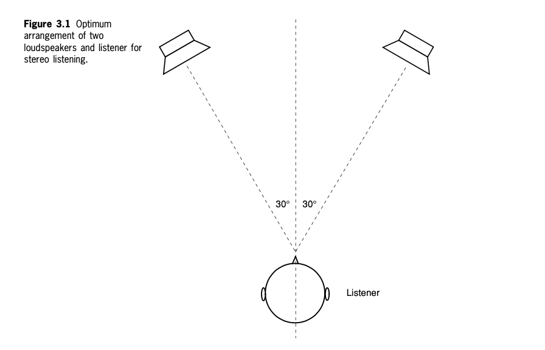

{}
Figure: Rumsey, *Spatial Audio*, Fig. 3.1, "Optimum arrangement of two loudspeakers and listener for stereo listening."

- ±30° is standardized in ITU-R BS.775, and it is the basis for the front three channels of 5.1 as well.
- Listening position changes the image:
  - Too far forward (inside the triangle): image too wide, hole in the center.
  - Too far back: image too narrow, collapsing toward mono.
  - Off-center: images pull toward the nearer speaker, because that speaker now arrives earlier and louder.
- Ask the studio question here: where is the sweet spot in our control room, and how big is it really?
{}

---

## Summing Localization

- Each ear hears **both** speakers
- The far one arrives about 0.26 ms later

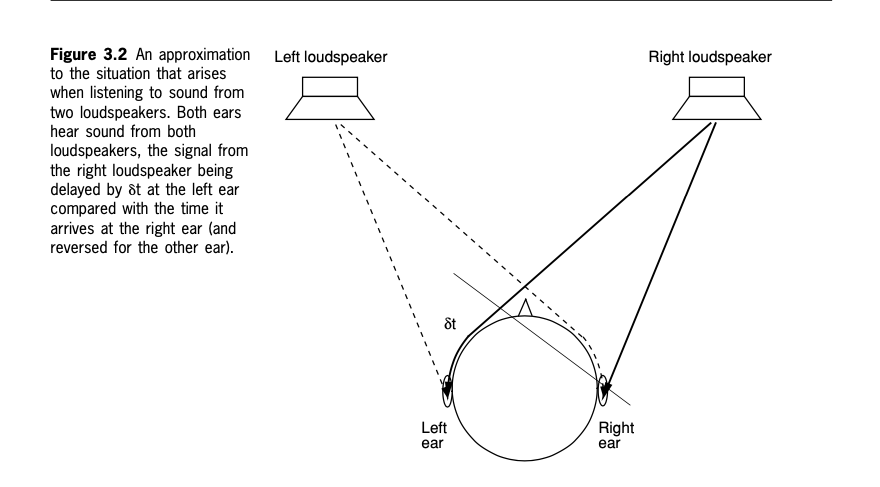

{}
Figure: Rumsey, *Spatial Audio*, Fig. 3.2. This is interaural crosstalk: sound from the right speaker reaches the left ear delayed by δt relative to the right ear, and vice versa.

- Summing localization is the name for what happens when coherent signals arrive at the ears within about 1 ms: we hear one fused event, a phantom source, and its direction depends on the level and time differences.
- Two ways to steer a phantom image between the speakers:
  - **Amplitude difference** between channels. This is what a pan pot does.
  - **Interchannel time difference** below roughly 1 ms. This is what spaced microphone arrays do.
- Rough numbers worth knowing: about 7-8 dB, or about 0.5 ms, moves the image roughly halfway to one speaker. About 15-18 dB, or about 1.0-1.5 ms, pins it fully at that speaker.
- Past that window the precedence effect takes over, which we covered on 9/11: we localize toward the first arrival rather than hearing a phantom between the two.
- Headphones are a different case. Each channel goes to one ear only, so there is no crosstalk and no summing. Amplitude panning gives in-head lateralization instead of a source out in the room. That is the externalization problem from the psychoacoustics deck.
{}

---

## Real vs. Virtual Source

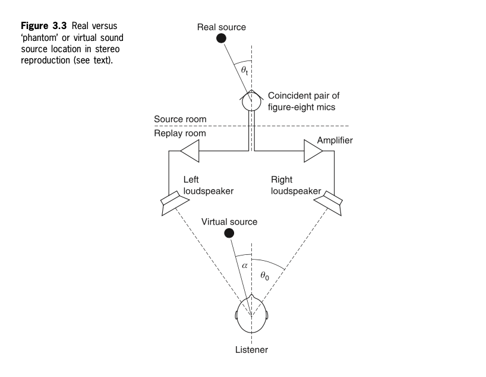

{}
Figure: Rumsey, *Spatial Audio*, Fig. 3.3. The mics here are a coincident pair of figure-eights, which is a Blumlein pair. We take that array apart on Wednesday.

- The goal of a stereo recording technique is that the virtual source angle α on playback matches the real source angle θt at the microphone.
- The angles rarely match exactly. Each technique has a recording angle, and sources outside it get pushed to the speakers.
- Note that the phantom image only exists for a listener in the sweet spot. There is nothing radiating from that point in space.
{}

---

### Phantom and Discrete Images

- **Discrete** (hard-panned, or a real center speaker): clearer, more precise, smaller
- **Phantom**: larger, less focused, slightly colored

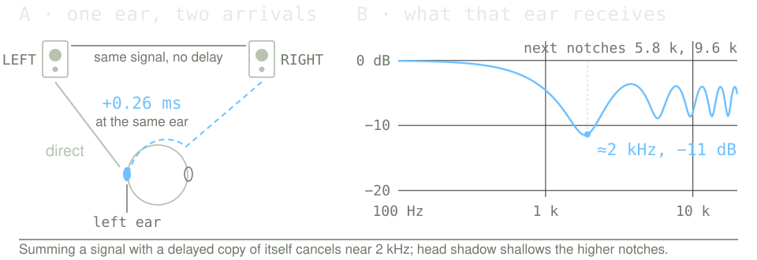

{}
- A discrete image comes out of one speaker only: hard panning, or an actual center channel. No crosstalk summing, so no coloration.
- A phantom image is built by summing localization, not by comb filtering. Get the causal order right: summing localization creates the image; crosstalk comb filtering colors it.
- The speakers are not doing any of the work here. For a center-panned source there is no interchannel level difference and no interchannel time difference: both speakers emit the same signal at the same moment. Every difference in the left panel comes from the geometry of the listener's head.
- Keep two comparisons apart, because this is the step students conflate:
  - **ITD and ILD** compare the left ear with the right ear. For a centered listener and a center-panned source both are zero, which is exactly why the image sits in the middle.
  - **The crosstalk delay** compares two arrivals at the *same* ear: its near speaker first, then the far speaker. That is what combs the spectrum.
- They come out to the same 0.26 ms, and not by coincidence. By mirror symmetry the path from the right speaker to the left ear equals the path from the left speaker to the right ear, so one number serves both comparisons. Say this out loud; the coincidence is what makes the two look like the same thing.
- Speaker angle sets how big the delay is, so it sets the notch frequency: about 0.20 ms and a notch near 2.5 kHz at ±22.5°, 0.26 ms and 1.9 kHz at ±30°, 0.38 ms and 1.3 kHz at ±45°. A wider setup drags the dip toward the vocal range. Head size does the same thing, which is part of why listeners do not all hear this coloration identically.
- Once the listener moves off center, or the source is panned away from the middle, the symmetry breaks: now there is a genuine difference between the ears, and each ear gets its own asymmetric comb.
- Where the coloration comes from: the crosstalk delay of about 0.26 ms puts the first cancellation notch near 1/(2 × 0.26 ms) = 1.9 kHz, with further notches at 5.8 and 9.6 kHz that grow shallower as head shadow attenuates the crossed path. That broad dip around 2 kHz is why a phantom center vocal or snare sounds slightly hollow next to the same sound from a real center speaker. Room reflections fill it in somewhat.
- Processing can push images slightly outside the speaker pair: shufflers, crosstalk cancellation, stereo wideners. These are also the processes most likely to collapse or thin out in mono, so check.
{}

---

## The Stereo Soundstage

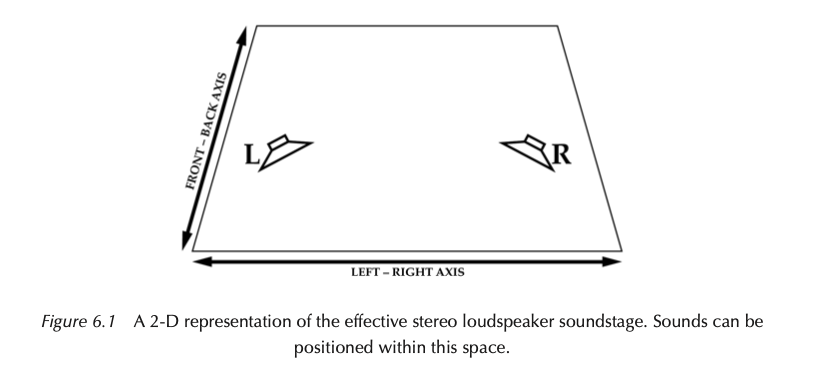

{}
Figure: Corbett, *Mic It!* 2e, Fig. 6.1.

- Think of the mix as a two-dimensional stage: left-right position, and front-back depth.
- The trapezoid shape is the point. The usable width narrows as sounds move back, because distant sounds carry weaker directional cues.
- On headphones the depth cues still work, since level, brightness, and direct-to-reverberant ratio all survive. What changes is externalization and the left-right geometry, so the same mix reads differently. Corbett asks students to audition his examples on both.
{}

---

### Image Width

- Mono point sources: centered, off-center, or hard to one side
- Spread images: narrow or wide, symmetric or asymmetric

{}
- A mono source through a pan pot always makes a narrow, focused image, wherever you put it.
- Spread images come from stereo mic arrays, stereo synths, and stereo effects returns. Their width is a property of the source material, not just the pan control.
- Watch for the trap in Example 6.4: a stereo source with both channels panned center is a mono phantom, not stereo.
{}

---

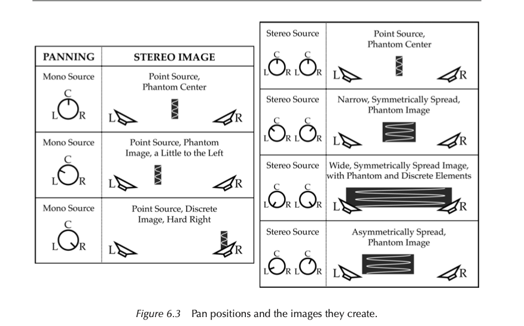

{}
Figure: Corbett, *Mic It!* 2e, Fig. 6.3. Mono and stereo sources and the images each produces.

Walk the left column first (mono sources), then the right (stereo sources). The audio examples on the next slide are numbered to match this figure.
{}

---

### Listen: panning

Point source or spread image?

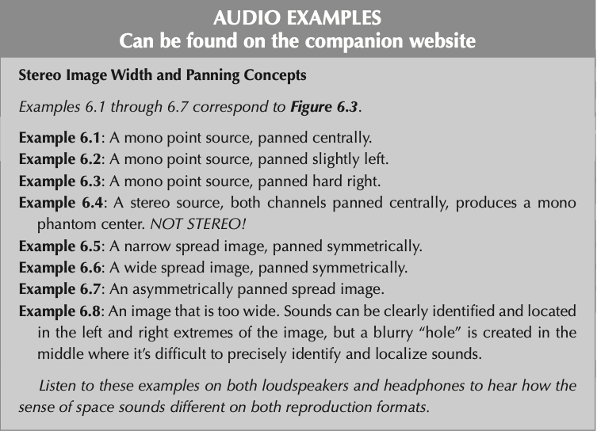

[*Mic It!* companion audio](https://routledgetextbooks.com/textbooks/9780367470364/audio_files.php)

{}
Examples 6.1-6.8 correspond to Fig. 6.3. Play 6.4 and 6.8 at minimum: 6.4 is the stereo-source-panned-center trap, 6.8 is the too-wide image with a hole in the middle.

If time allows, play a couple on speakers and then on headphones so they hear the difference for themselves.
{}

---

## Beyond the Loudspeakers

- **Decorrelation** widens: different L and R signals, from short delays, chorus, or stereo reverb
- **Polarity inversion** widens too, but cancels in mono
- Always check the mono fold-down

{}
- Keep these two separate. Decorrelated content is genuinely different in each channel, so it sounds wide and mostly survives a mono sum. Deliberately flipping the polarity of one channel also reads as very wide, but the content disappears when the channels are summed.
- Wide decorrelated material can seem to extend past the speaker positions. Synth pads and large hall reverbs are the usual examples.
- Context matters: a source reads as super-wide partly by comparison with narrower material around it.
- Mono compatibility is a graded item on Project 2, and it is the same check we run on spaced microphone arrays on Wednesday.
{}

---

## Depth in the Stereo Field

You already know the distance cues. Now place them on the stage.

- Direct-to-reverberant ratio does most of the work
- Level sets apparent distance within a section
- High-frequency rolloff supports the illusion

{}
Callback, not a re-teach: we derived these cues on 9/9 in the distance perception deck. The point today is deploying them deliberately across the width of the mix.

- **Direct-to-reverberant ratio** is the strongest and most reliable depth cue. Dry and close, or wet and distant.
- **Level** works within a group of similar sounds. On its own it reads as "quieter", not "farther".
- **High-frequency attenuation** is real air absorption, but it only becomes significant over tens of meters. In a mix at short range it works as a convention that supports the other two cues rather than as physics.
- A bright, dry sound can appear forward of the speaker line, which is Corbett's Example 6.9.
{}

---

### Listen: depth

Same source, three depths. What changed between 6.9 and 6.10?

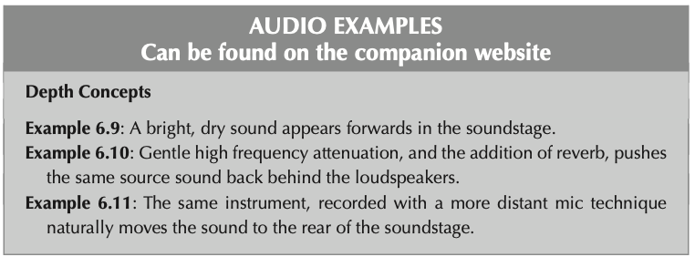

[*Mic It!* companion audio](https://routledgetextbooks.com/textbooks/9780367470364/audio_files.php)

{}
Examples 6.9-6.11. Note that 6.11 gets its depth from mic placement at the recording stage rather than from processing afterward, which is the cheapest and most convincing way to do it.
{}

---

## Static and Dynamic Panning

- **Static**: the position does not change through the mix
- **Dynamic**: fly-bys, auto-panning, ping-pong and question/answer moves

{}
- **Fly-bys**: a sound travels smoothly across the image, usually with matching level and filtering changes so the movement is believable.
- **Auto-panning**: an LFO moves the source continuously. Easy to overdo.
- **Ping-pong or antiphonal**: alternating figures bounced between the sides.
- Most mixes are mostly static. Movement earns attention precisely because it is rare, so save it for something that matters.
- Project 2 asks for at least two panning automation moves, one of them dynamic.
{}

---

### Listen: static vs. dynamic

Track one moving element in 6.13. Does the movement serve the mix or distract from it?

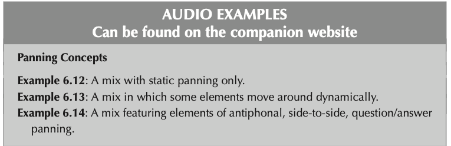

[*Mic It!* companion audio](https://routledgetextbooks.com/textbooks/9780367470364/audio_files.php)

{}
Examples 6.12-6.14: static only, dynamic elements, and antiphonal question/answer panning.
{}

---

## Image Symmetry

- Balance weight on the left against weight on the right
- Spread percussion across the field

Compare 6.15 and 6.16.

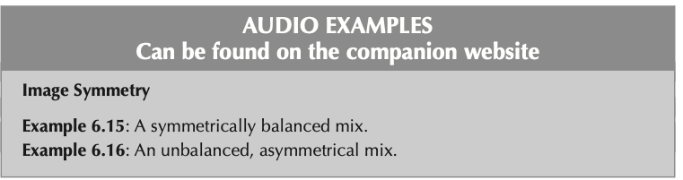

{}
Examples 6.15 and 6.16: a symmetrically balanced mix, and an unbalanced one.

Symmetry is about perceived weight, not about mirroring parts literally. Low end and lead vocals normally stay centered for level and playback reasons; the balancing happens with everything else.
{}

---

### Possible Stereo Image

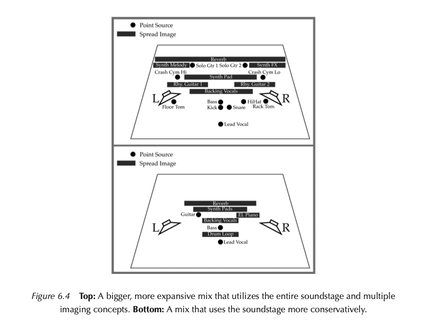

{}
Figure: Corbett, *Mic It!* 2e, Fig. 6.4. Top is a dense mix using the whole soundstage; bottom is a sparser mix using it conservatively.

Both are valid. Corbett presents them as alternatives, not as a good example and a bad one. A wide, busy image suits dense arrangements; a sparse one suits a small ensemble or anything where clarity of a few elements matters most. This matches the line we took on 9/11: wider is not automatically better.

The question to ask of a mix is whether the image serves the material, not whether every region of the stage is occupied.
{}
