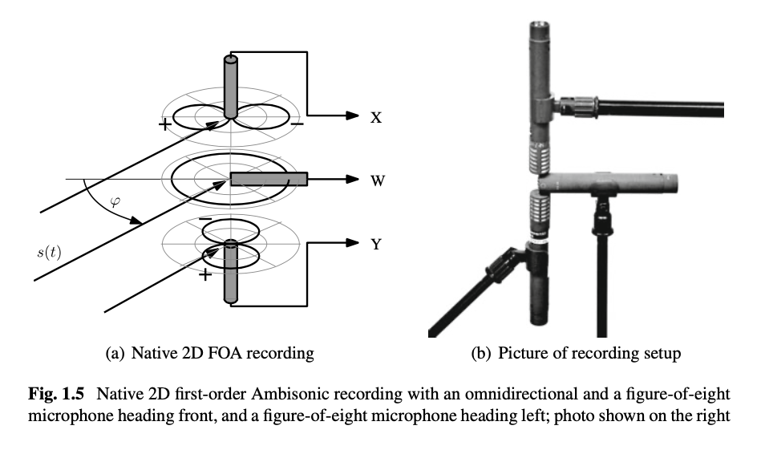
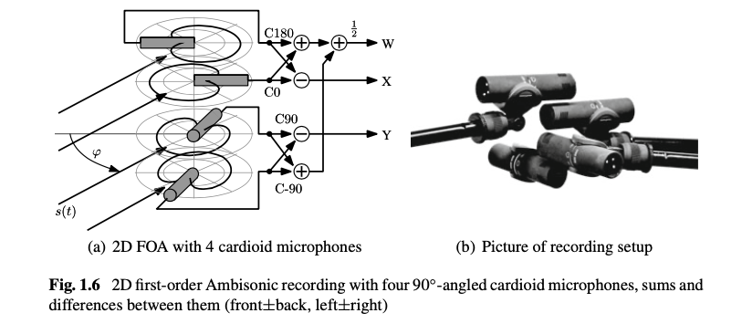
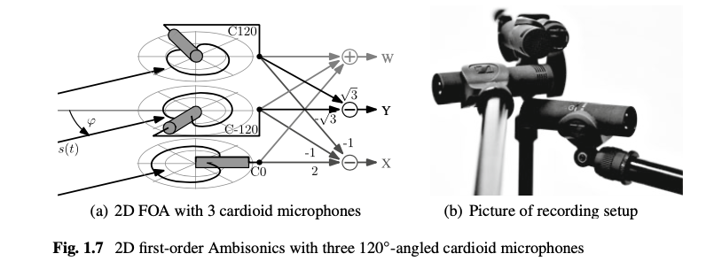
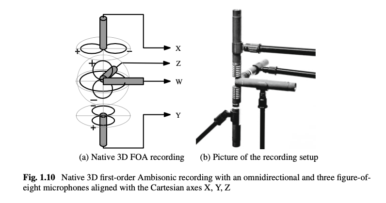
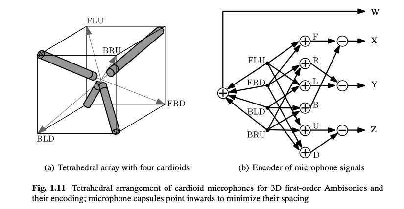
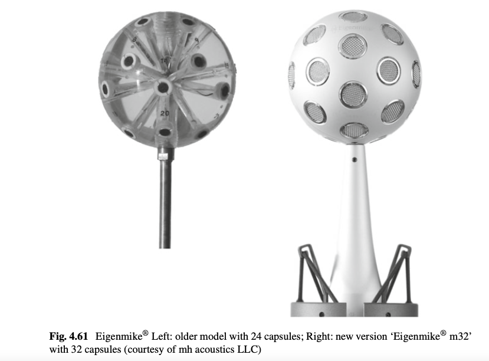

+++
title = "Ambisonics Recording"
outputs = ["Reveal"]
[reveal_hugo]
margin = 0.2
+++

# First-Order Ambisonics (FOA)

ref: [The Double Mid-Sides Array](https://www.soundonsound.com/techniques/double-mid-sides-array)

{}
Double Mid-Side (DMS) extends the classic MS pair by adding a rear-facing cardioid. The three coincident capsules provide:

- `M_front`: forward cardioid capturing direct sound.
- `M_rear`: backward cardioid providing ambience behind the array.
- `S`: side-facing figure-8 that measures left/right pressure differences.

Simple matrixing turns these feeds into the horizontal FOA channels: W comes from the sum of `M_front` and `M_rear`, X from their difference, and Y from the side figure-8. Adding an up/down figure-8 capsule (Triple MS) contributes the Z channel for full-sphere FOA while keeping the array phase-coincident.
{}

---

### Native 2D Ambisonic recording (Double-MS)

{}
Matrix the forward and rear cardioids for W and X, and keep the side figure-8 for Y. Precise gain matching keeps the derived patterns orthogonal.
{}

---

### 2D Ambisonic recording with four 90◦-angled cardioids

{}
Four 90° cardioids can be decoded to FOA by summing opposite capsules for W and differencing for X and Y. This is common on broadcast rigs that lack figure-8 options.
{}

---

### 2D Ambisonic recording with three 120◦-angled cardioids

{}
Three 120° cardioids form an equilateral cluster; with appropriate weighting they approximate the FOA horizontal components when a rear-facing capsule is impractical.
{}

---

### Native 3D Ambisonic recording (Triple-MS)

{}
Triple MS is Double MS plus a vertical figure-8 capsule, yielding the Z component required for full-sphere FOA capture.
{}

---

### 3D Ambisonic recording with a tetrahedral arrangement of cardioids

{}
A tetrahedral cardioid cluster (e.g., Soundfield or Ambeo) outputs four A-format signals that are later converted to the B-format W, X, Y, Z channels.
{}

---

# Higher-Order Ambisonics (HOA)

Higher orders sample additional spherical harmonics; an order-N recording carries (N + 1)^2 channels, improving localization at the cost of more capsules and processing power.

---

### Eigenmike®

[Sound Demos](https://mhacoustics.com/demos) - listen with headphones, we'll listen to some in studio B later.

{}
The 32-capsule Eigenmike captures up to fourth-order Ambisonics (25-channel B-format) from a single phase-coincident array.
{}

---

### Octomic

[Octomic](https://www.core-sound.com/products/octomic)

{}
Core Sound's OctoMic uses eight cardioid capsules to deliver native second-order Ambisonics, providing cleaner pattern separation than tetrahedral FOA arrays while remaining portable.
{}

---

### Zylia

[ZM-1](https://www.zylia.co/zylia-zm-1-microphone.html)

{}
Zylia's 19-capsule ZM-1 captures third-order Ambisonics and ships with software for beamforming, binaural rendering, and flexible virtual microphone pattern design.
{}

---

### Sennheiser AMBEO VR Mic

[AMBEO VR Mic](https://www.sennheiser.com/en-us/catalog/products/microphones/ambeo-vr-mic/ambeo-vr-mic-507195)

{}
Compact tetrahedral cardioid array that outputs A-format signals and includes an Ambisonic plug-in to convert to B-format (AmbiX or FuMa). Rugged and widely supported in DAWs for FOA field capture.
{}

---

### Zoom H3-VR

[H3-VR 360-degree Recorder](https://zoomcorp.com/en/us/handheld-recorders/handheld-recorders/h3-vr-360-audio-recorder/)

{}
All-in-one FOA recorder with onboard tetrahedral mic, integrated Ambisonic decoding/encoding, and six-axis gyro that tracks orientation for post alignment--ideal for quick VR ambience beds.
{}

---

### RODE NT-SF1

[NT-SF1](https://rode.com/en-us/microphones/broadcast/nt-sf1)

{}
Studio-grade SoundField-designed tetrahedral condenser aimed at music and film work; supplied SoundField plug-in offers adjustable virtual patterns and precise B-format output for FOA workflows.
{}
