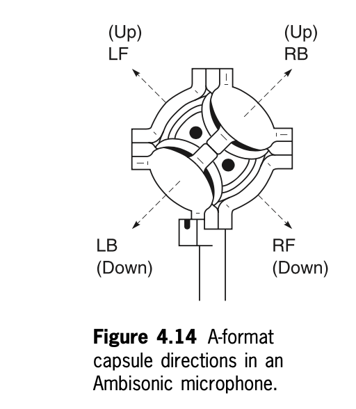
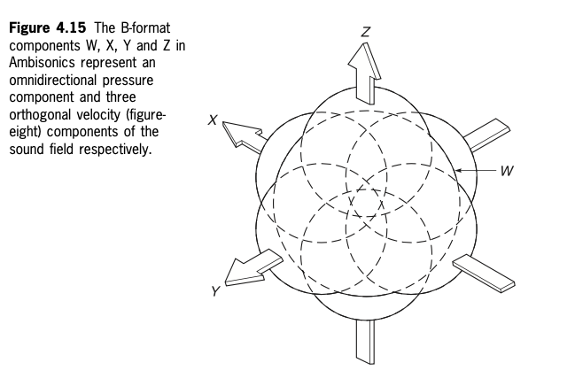
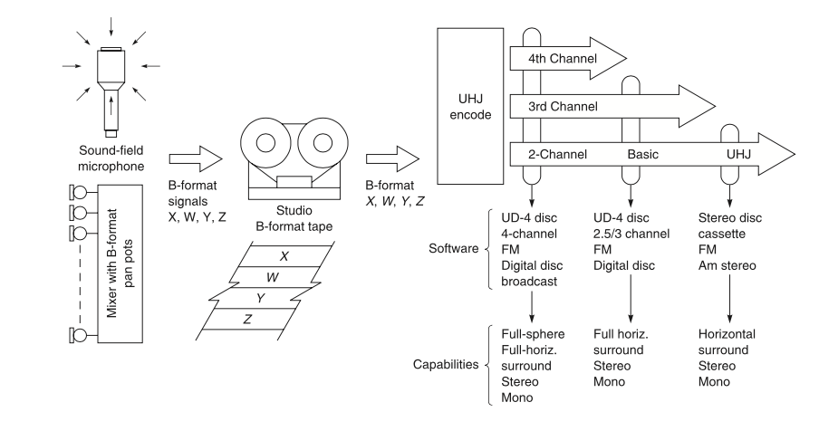
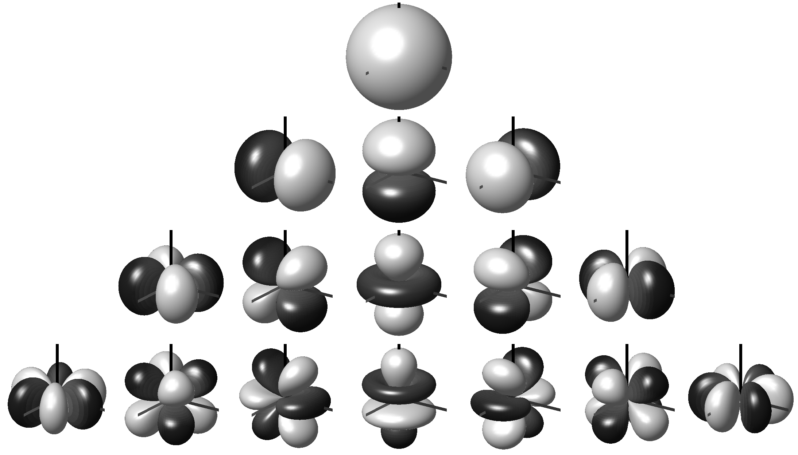

+++
title = "Ambisonics Introduction"
outputs = ["Reveal"]
[reveal_hugo]
margin = 0.2
+++

# Listen to some Ambisonics field recordings 

---

### Ambisonics: Rethinking Surround Sound

* Developed in the early 1970s as a **response to the limits of quadraphonic sound**.
* Michael Gerzon argued quad systems **failed to give reliable spatial localization** for listeners.
* Supported by the UK’s **National Research and Development Corporation (NRDC)** and Prof. Peter Fellgett.
* Goal: **accurate 3D sound fields** around a listener using **psychoacoustic principles** rather than matrix tricks.

{}
Ambisonics set out to reproduce a true sound field, matching how our ears and brain localize audio cues.
Unlike quadraphonic sound, which relied on four fixed speakers and phantom images, Ambisonics encodes the entire sound sphere so it can be decoded to any playback array.
{}

---

### Capturing the Sound Field: The Soundfield Microphone

* **Inventors:** Michael Gerzon & Peter Craven.
* Early idea: a **spherical mic array**; final design: **four capsules in a tetrahedral pattern**.
* Records the **complete 3D acoustic environment**, not just a stereo panorama.
* Became the **core hardware** of the Ambisonic system.

{}
The Soundfield mic uses four closely spaced capsules arranged tetrahedrally to capture both **pressure** and **directional velocity** of sound.
This raw capture (A-format) is later transformed into B-format, allowing rotation or decoding for any loudspeaker configuration or headphones.
{}

---

### From Recording to Playback

* **First Ambisonic recording (1975):** Schola Cantorum of Oxford.
* Playback typically used a **square or circular loudspeaker array** for horizontal surround.
* **Flexible decoding** means the same recording works on many setups—
  from headphones to large multichannel systems—while preserving spatial accuracy.

{}
Ambisonic recordings are independent of playback layout.
Whether four speakers, a dome of many, or binaural headphones, the decoding math adapts to the arrangement without losing spatial detail—a key advantage over quadraphonic or fixed 5.1 systems.
{}

---

<iframe width="560" height="315" src="https://www.youtube.com/embed/X23hZNoSkUs" title="YouTube video player" frameborder="0" allow="accelerometer; autoplay; clipboard-write; encrypted-media; gyroscope; picture-in-picture" allowfullscreen></iframe>

---

### BBC R&D Ambisonics Intro

[Ambisonics and Periphony](https://www.bbc.co.uk/rd/blog/2010-03-ambisonics-periphony-audio-sound)

{}
- Ambisonics allows for more flexible sound field recording and playback compared to traditional 5.1 systems.
- 5.1 surround sound requires specific speaker positioning, while Ambisonics does not, offering flexibility for listeners with different setups.
- BBC R&D is exploring Ambisonics to reduce complexity in multi-channel sound formats.
- Ambisonics could also provide a more efficient way to archive sound recordings since it adapts to future playback systems without needing new mixes for every format.
{}

---

* **Key Theorists:** Michael Gerzon, Peter Fellgett, Geoff Barton
* **Core Idea:** A **hierarchical system** for capturing, storing, and reproducing a 3D sound field.
* **Scalable Output:** Works from mono to full-sphere surround with height.
* **Main Formats:**
  * **A-format** – raw mic signals from the tetrahedral array
  * **B-format** – studio-ready sound-field representation
  * **C-format / UHJ** – stereo-compatible consumer release
  * **D-format** – speaker-specific decoding (rare today)

{}
Ambisonics treats the sound field as a *continuous sphere* and separates **capture**, **processing**, and **playback** into clear layers.

**Hierarchy & Flexibility**

* Add more channels → increase spatial precision without changing the original recording.
* One B-format master can be decoded for headphones, 5.1, 7.1, or dome arrays.

**Formats Explained**

* **A-format**: Four raw mic outputs from the tetrahedral Soundfield microphone. Exact capsule orientation varies by manufacturer; these signals must be converted before use.
* **B-format**: Core Ambisonic format with four channels—W (omni pressure) plus X, Y, Z (figure-eight velocity components). Enables rotation, mixing, and decoding to any speaker layout.
* **C-format / UHJ**: Stereo-friendly distribution. Two channels (L/R) preserve mono compatibility; optional T and Q channels add full surround when decoded.
* **D-format**: Decoded feeds for a specific speaker rig (e.g., a 7.1 theater). Rare today but conceptually the last step—turning B-format into speaker signals.

This layered design future-proofs recordings: a single B-format capture can adapt to new playback formats without remixing.
{}

---

* **Quadraphonic (4-channel)**
  * Fixed to four speakers in a square
  * Creates “phantom images” between pairs of speakers
  * Spatial image collapses if the listener moves off center
  * Known “hole in the middle” problem for front imaging
* **Ambisonics**
  * Records a full 360° sound field (pressure + directional velocity)
  * Decodes to *any* loudspeaker layout or binaural headphones
  * Maintains spatial accuracy even for off-center listeners

{}
**Core Difference**
Quadraphonic systems rely on fixed speaker placement and amplitude panning. Move your head and the spatial illusion weakens.

**Ambisonic Approach**

* Encodes the entire sound sphere using *pressure* (W) and *velocity* (X,Y,Z) components.
* Decoding software calculates the correct amplitude for each loudspeaker via an amplitude matrix.
* Psychoacoustic shelf filtering above \~700 Hz compensates for head-shadowing, ensuring stable localization.

This means a single Ambisonic recording can play back on anything—from stereo headphones to large dome arrays—without losing its spatial character.
{}

---

### Ambisonic Microphones and Virtual Sources

- **Ambisonic Microphones**:
    - [Sennheiser AMBEO VR Microphone](https://en-us.sennheiser.com/microphone-3d-audio-ambeo-vr-mic)
    - [RØDE NT-SF1](https://rode.com/en-us/microphones/360-ambisonic/nt-sf1)
    - [NEVATON VR](https://nevaton.eu/product/nevaton-vr-ambisonic-microphone/?v=fa868488740a)
    - [Zoom H3-VR](https://zoomcorp.com/en/us/handheld-recorders/handheld-recorders/h3-vr-360-audio-recorder/)
    - [Soundfield SPS200](https://www.soundfield.com/#/products/sps200)
- **Virtual Source**:
    - Ambisonic signals can also be created by panning a mono signal to place it in a specific position within a 3D sound field, useful in **VR/AR** and **game audio**.

{}

- Ambisonic signals are captured with specialized microphones like the [Calrec Soundfield](https://calrec.com/soundfield/).
- Virtual sources are generated by panning mono signals across Ambisonic channels (W, X, Y, Z) to position sound in 3D space.

{}

---

### Signal formats - A format

{}

The A-format consists of four signals from a microphone with four sub-cardioid capsules arranged as shown in **Figure 4.14**. These capsules are mounted on the four faces of a tetrahedron and oriented to capture sound from different directions:

- **LF (Left-Front)**: Points upward and forward, capturing sound from the left and front.
- **RF (Right-Front)**: Points downward and forward, capturing sound from the right and front.
- **LB (Left-Back)**: Points downward and backward, capturing sound from the left and rear.
- **RB (Right-Back)**: Points upward and backward, capturing sound from the right and rear.

This arrangement allows the microphone to record sound from all directions, creating the raw **A-format** signals. These signals are later converted into **B-format** for further manipulation and playback in Ambisonic systems. The tetrahedral layout, where two capsules point upwards and two point downwards, ensures comprehensive sound capture across the horizontal and vertical planes, which is essential for creating a 3D sound field in Ambisonics.

{}

---

### B format

{}

This diagram (**Figure 4.15**) illustrates the **B-format** components used in Ambisonics, which consist of four signals: **W**, **X**, **Y**, and **Z**.

- **W**: Omnidirectional pressure component, capturing sound uniformly from all directions.
- **X**, **Y**, and **Z**: Figure-eight components representing sound directionality:
  - **X**: Captures sound along the forward-backward axis (front-facing figure-eight).
  - **Y**: Captures sound along the left-right axis (sideways-facing figure-eight).
  - **Z**: Captures sound along the up-down axis (upward-facing figure-eight).

These components provide full 3D spatial sound representation, with **W**, **X**, and **Y** focusing on horizontal spatial information and **Z** adding vertical spatial detail.

### **Key Points**:

- **B-format consists of four signals**:
  - **W**: Omnidirectional (pressure) component.
  - **X, Y, Z**: Figure-eight components for capturing directional sound.
- **Spatial Information**:
  - **W, X, Y** provide horizontal spatial details.
  - **Z** provides vertical spatial information.
- **Comparison to MS Stereo**:
  - **X** is analogous to the **M (mid)** signal.
  - **Y** is analogous to the **S (side)** signal.
- **Recording Options**:
  - Record directly to B-format using FuMa or AmbiX encoding.
  - Alternatively, record in A-format and convert to B-format later.

### **Additional Information**:
- **FuMa encoding** is a more efficient method for storing and transmitting B-format audio compared to AmbiX.
- Encoding is not required if you are recording directly in FuMa format.

{}

---

| Feature    | A-format                                    | B-format                                                |
| ---------- | ------------------------------------------- | ------------------------------------------------------- |
| channels   | 4                                           | 4                                                       |
| Signal rep | Raw output of ambisonic microphone capsules | Derived from A-format using mathematical transformation |
| Efficiency | Less efficient                              | More efficient                                          |
| Ease?      | More difficult to work with                 | Easier to work with                                     |

{}
A-format and B-format are two ways of representing ambisonic audio signals.

A-format is the raw output of an ambisonic microphone. It is a set of four channels, each of which contains the signal from one of the microphone capsules.

B-format is a derived format that is more efficient and easier to work with than A-format. It is a set of four channels, but the signals in these channels are not the same as the signals in the A-format channels. The B-format channels are derived from the A-format channels using a mathematical transformation.

B-format is the preferred format for storing, transmitting, and processing ambisonic audio signals. It is also the format that is used by most ambisonic software and hardware.

Here is a table that summarizes the key differences between A-format and B-format ambisonics:

{}

---

### A- to B-Format Conversion

* **X** = 0.5 × \[(LF – LB) + (RF – RB)]
* **Y** = 0.5 × \[(LF – RB) – (RF – LB)]
* **Z** = 0.5 × \[(LF – LB) + (RB – RF)]
* **W** = 0.5 × (LF + LB + RF + RB)

{}
**Purpose**
Converts the four raw capsule signals of a tetrahedral Soundfield mic (**A-format**) into the standardized **B-format** components used for Ambisonic processing.

**Component Roles**

* **W (omni)** – sum of all capsules; captures overall sound pressure.
* **X (front–back figure-8)** – left–right difference for the forward axis.
* **Y (left–right figure-8)** – front–back difference for the side axis.
* **Z (up–down figure-8)** – vertical difference capturing height.

**Workflow**

* Typically performed in software plug-ins or DAWs, though hardware encoders exist.
* After conversion, B-format files can be rotated, mixed, or decoded to any speaker array or to binaural headphones.

**Why B-format Matters**

* **Efficient & Flexible:** Stores the sound field independent of playback layout.
* **Editable:** Allows precise spatial transformations (rotation, tilt) in post.
* **Compatible:** Accepted by most Ambisonic tools and VR/AR audio engines.

This step is the bridge from *microphone capture* to *fully manipulable 3D sound*.
{}

---

### C format - aka UHJ

{}

### **C-format Ambisonics & UHJ Format**

**C-Format Ambisonics:**
- Consists of four signals:  
  - **L**: Left  
  - **R**: Right  
  - **T**: Top  
  - **Q**: Quad
- **C-format** conforms to the UHJ (Universal HJ) hierarchy, a system designed for **mono** and **stereo-compatible** ambisonic transmission.
- Allows for Ambisonic playback on stereo speakers while preserving spatial information. Can be decoded with UHJ decoders like the **ATK**.

**UHJ Format Overview:**
- **B-Format**, commonly used for Ambisonic recordings, is **not stereo-compatible**. UHJ was developed to make Ambisonics more accessible by allowing stereo and mono compatibility.
- UHJ can carry increasing amounts of spatial information based on the number of channels:
  - **2-channel (L, R)**: Stereo-compatible, can recover three B-format signals (W, X, Y) with some loss.
  - **3-channel (L, R, T)**: Horizontal soundfield with more detail.
  - **4-channel (L, R, T, Q)**: Full-sphere, first-order soundfield reproduction.

**Encoding & Decoding UHJ:**
- UHJ encoding transforms **B-format signals (W, X, Y, Z)** into UHJ channels. Conversion requires **90-degree phase shifting**, typically done using digital convolution filters.
  
- **Encoding (B-Format to UHJ)**:  
  - For 2-channel UHJ, formulas use combinations of W, X, and Y to derive Left and Right channels.
  
- **Decoding (UHJ to B-Format)**:  
  - The process allows conversion back to B-format, with greater accuracy in 3- or 4-channel UHJ. However, some spatial information is lost when recovering B-format from 2-channel UHJ.

**Limitations of UHJ:**
- UHJ is restricted to **first-order soundfields** (horizontal or full-sphere) and cannot handle higher-order Ambisonics.
- Three- and four-channel UHJ recordings were never commercially released, though many 2-channel UHJ LPs and CDs exist.
- Converting B-format to UHJ and vice versa is possible without significant loss, but the recovery of full B-format from 2-channel UHJ does involve some compromise.
  
**Practical Use of UHJ:**
- **Stereo Compatibility**: UHJ allows Ambisonic files to be played on regular stereo systems. The T and Q channels are used for adding spatial information but can be discarded for simple stereo playback.
- **File Format Limitations**: The ".uhj" format is based on WAVE or WAVE-EX files and maintains stereo compatibility by adding a UHJ chunk. However, it is limited to 2-channel UHJ, and Microsoft’s guidelines prevent proper stereo compatibility with 3- or 4-channel UHJ files.

{}

---

### D-Format: Decoding for Playback

* **Purpose:** Converts Ambisonic recordings into speaker feeds for a specific layout.
* **Typical setups:**
  * **4 speakers** – adequate surround field
  * **6 speakers** – better control of transients and sibilants
  * **8 speakers** – full periphony with added height

{}
**What D-Format Is**

* Not a separate recording format—it’s the *decoded output* from B-format tailored to a particular loudspeaker array.
* Example: A D-format decoder feeding a 7.1 home theater or a VR headset’s multichannel system.

**Use Cases**

* Home theater or studio playback where the speaker layout is fixed.
* Certain VR/AR systems that need pre-decoded channel feeds.

**Advantages**

* Optimizes spatial accuracy for the exact speaker configuration.
* Efficient to store and transmit once decoding is finalized.

**Key Takeaway**
Think of D-format as the *last step* of the Ambisonic chain: transforming a flexible B-format master into a ready-to-play speaker mix for a defined environment.
{}

---

### Higher order Ambisonics

{}

### **Higher-Order Ambisonics and Spherical Harmonics**

The image depicts **spherical harmonics** used in **higher-order ambisonics** (HOA), with the shapes visually representing the **sound field components** up to the third order. Each shape corresponds to a different spherical harmonic function used in HOA.

- **First row**: Represents the **0th order**, which is an **omnidirectional** polar pattern (W component). This captures sound equally from all directions.
- **Second row**: Shows the **1st order** components (**X, Y, Z**), which are **figure-eight** patterns that represent directional sound (front-back, left-right, up-down).
- **Subsequent rows**: Depict **higher-order harmonics** used in HOA. These patterns represent more complex spatial information, enabling a finer level of directionality and detail in the sound field.

### **Summary of Higher-Order Ambisonics (HOA)**:
- **Greater Accuracy**: HOA uses these higher-order spherical harmonics to capture and reproduce sound fields with higher precision than traditional first-order Ambisonics.
- **Complex Sound Fields**: The more complex polar patterns in higher orders allow for better spatial resolution and sound localization.

### **Challenges of Higher-Order Ambisonics**:
- **Computational Complexity**: More spherical harmonics mean more calculations, which increases the processing power required.
- **Storage Requirements**: The additional spherical harmonics require more data to store the sound field accurately.
- **Playback Support**: Not all playback systems or software support higher-order ambisonics, limiting its practical use.

{}

---

### Current Developments in Ambisonics

* **Open Source**: [Opus 1.3](https://jmvalin.ca/opus/opus-1.3/) codec now supports Ambisonics for efficient, high-quality distribution.
* **Format Ecosystem**: [Existing formats](https://ambisonics.iem.at/xchange/fileformat/existing-formats) continue to evolve for flexible playback.
* **Industry Adoption**
  * Google: [Spatial Audio RFC](https://github.com/google/spatial-media/blob/master/docs/spatial-audio-rfc.md)
  * YouTube: [180/360° video with spatial audio](https://support.google.com/youtube/answer/6178631?hl=en-GB)
  * Oculus: [VR spatial audio toolkit](https://developer.oculus.com/documentation/native/audio-intro/)
  * Hardware: [Sennheiser Ambeo VR](https://en-us.sennheiser.com/microphone-3d-audio-ambeo-vr-mic), [Zoom H3-VR](https://zoomcorp.com/en/us/handheld-recorders/handheld-recorders/h3-vr-360-audio-recorder/)
  * Research: Ongoing [BBC R\&D](https://www.bbc.co.uk/rd/search?query=Ambisonics&Type=All&=2020)

{}
**Open Source & Standards**

* The Opus 1.3 codec brings free, high-quality Ambisonic support, easing distribution for VR, AR, and web streaming.

**Industry Momentum**

* Google and YouTube integrate Ambisonics into 360° media workflows.
* Oculus provides native VR audio support for fully immersive experiences.

**Hardware Growth**

* Affordable microphones like Sennheiser’s Ambeo VR and Zoom H3-VR broaden access for field recordists and indie creators.

**Research & Future**

* BBC R\&D continues to explore higher-order Ambisonics for broadcast and interactive media, signaling strong long-term potential.

Together, these developments show Ambisonics moving from experimental to mainstream, with open standards and commercial platforms driving adoption across gaming, film, and VR/AR.
{}

---

### Gaming & Ambisonics

* Game Engines: [Unity](https://docs.unity3d.com/Manual/AmbisonicAudio.html) | [Unreal Engine](https://docs.unrealengine.com/5.0/en-US/native-soundfield-ambisonics-rendering-in-unreal-engine/)
* Spatial Audio Tools: [Resonance Audio](https://resonance-audio.github.io/resonance-audio/discover/overview.html) | [Steam Audio](https://valvesoftware.github.io/steam-audio/#learn-more)
* Example in Action: Battlefield 1 & V – [Developer Talk](https://www.youtube.com/watch?v=84EDwVHY2BY)

{}
**Game Engine Support**

* Unity and Unreal both include native Ambisonic decoding, letting developers drop B-format recordings directly into interactive VR/AR environments.

**Spatial Audio Middleware**

* **Resonance Audio** and **Steam Audio** expand Ambisonic workflows with HRTF processing, room modeling, and real-time sound-field rendering.

**Case Study: Battlefield Series**

* DICE used Ambisonics to create a 360° battlefield atmosphere where players can pinpoint distant gunfire or aircraft, improving both immersion and tactical gameplay.

**Key Takeaway**
Ambisonics gives game audio designers a *future-proof, format-agnostic* path to spatial sound, from VR headsets to large multichannel installations.
{}

---

### Advanced & Emerging Game Audio

* **Higher-Order Ambisonics in Wwise** – up to **5th order**, with automatic encoding/decoding for dynamic ambiences
  [Wwise Ambisonics Overview](https://www.audiokinetic.com/products/ambisonics-in-wwise/) |
  [Dynamic Ambience Workflow](https://www.audiokinetic.com/en/blog/using-ambisonics-for-dynamic-ambiences/)
* **Cloud / Networked Gaming** – low-latency Ambisonic streaming via the open [Opus 1.3 codec](https://jmvalin.ca/opus/opus-1.3/)

{}

* **Wwise HOA** allows designers to achieve extremely fine spatial detail and adapt to any playback setup.
* **Vision Pro** demonstrates Ambisonics in mixed reality, aligning audio with precise head and room tracking.
* **Opus 1.3** ensures efficient delivery of Ambisonic streams for cloud gaming and VR.
* **Research like AudioMiXR** points toward AI-driven, interactive spatial audio that responds to player movement in real time.
  {}

