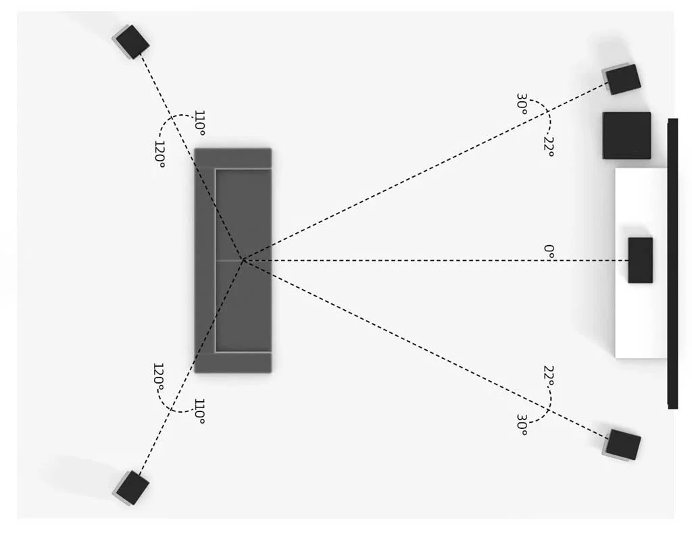
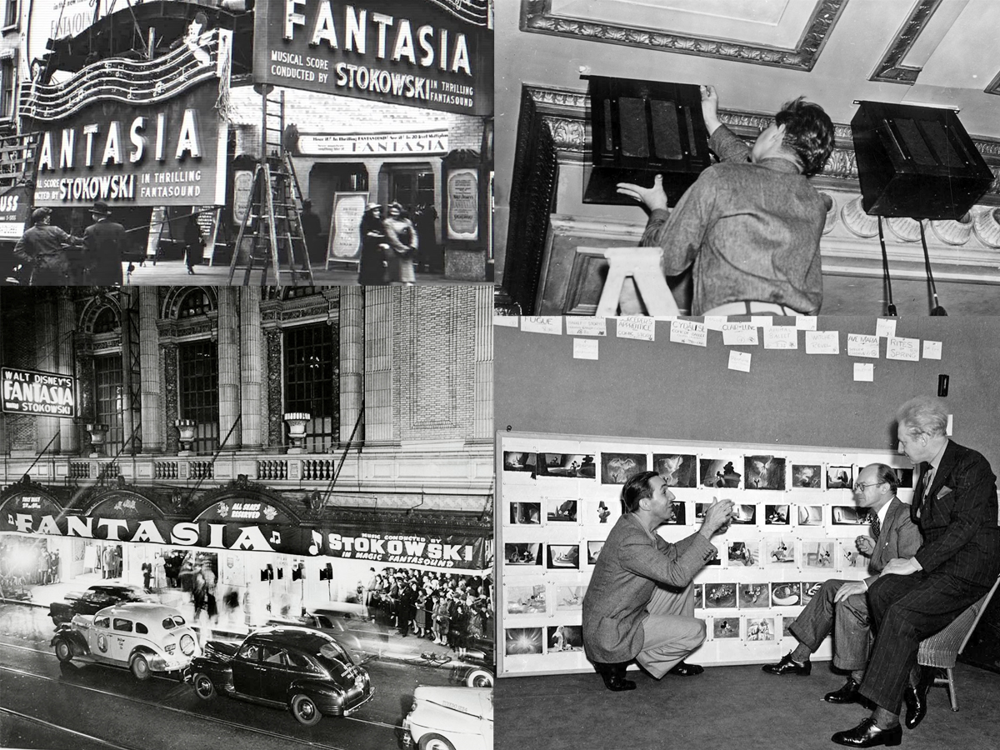
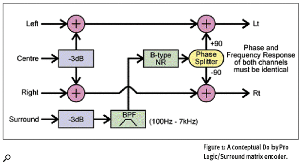
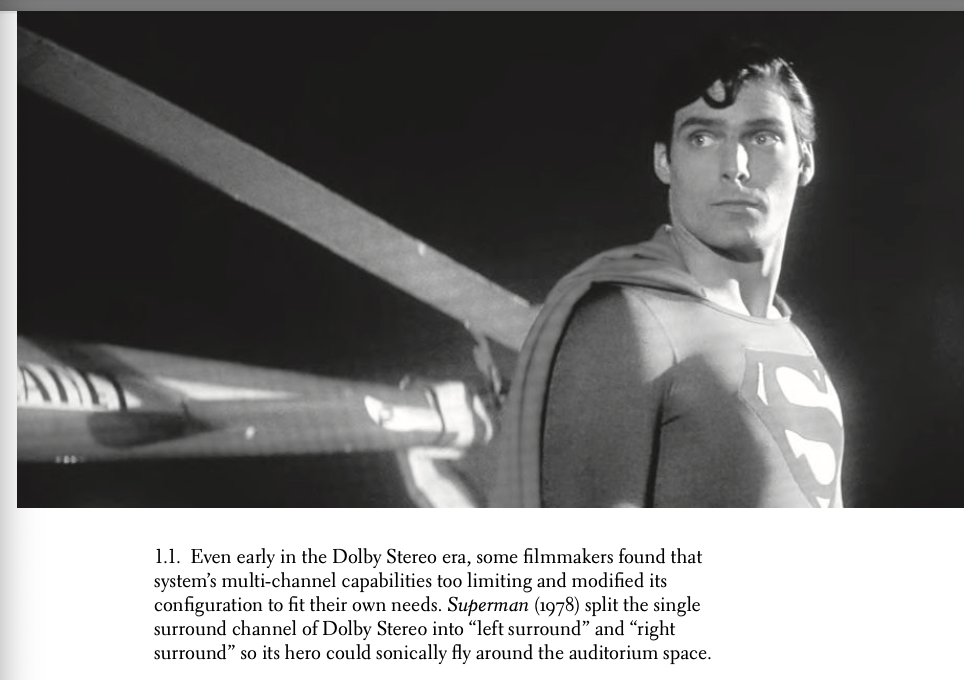
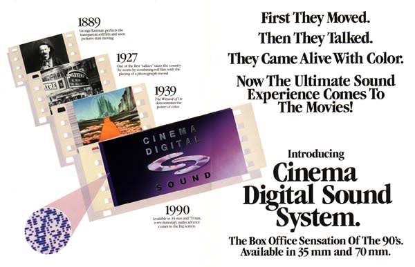
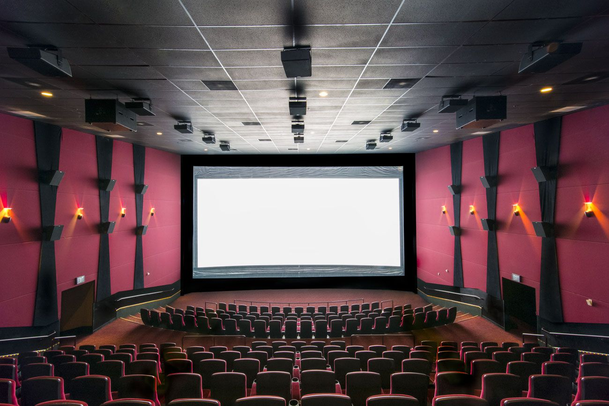

+++
title = "Cinema's Hidden Multi-Channel History and the Origins of Digital Surround"
outputs = ["Reveal"]
[reveal_hugo]
margin = 0.2
custom_css = "hugo.css"
+++



## Cinema's Hidden Multi-Channel History

### and the Origins of Digital Surround

---

> It was at the 1987 October SMPTE meeting. People were saying, “How many channels should there be [in the digital sound standard for cinema]?” And people said two . . . people said four . . . one said eight. And I put my hand up and said, “five point one.” Everybody went, “What is he talking about?”
>
> -- <cite>Tomlinson Holman, audio engineer and inventor of THX</cite>

---

#### Cinema's Hidden Multi-Channel History and the Origins of Digital Surround

{}
Ramifications of the decision to adopt 5.1:

* **5.1 became the worldwide standard** for cinemas and later home theater.
* **Immersive soundstage**: more realism and envelopment.
* **Filmmaking opportunities**: discrete placement, complex sound design.
* **Limitations**: no vertical dimension, diffuse surround arrays, constrained compared to Atmos/DTS:X.

The decision was a compromise: good enough, backward compatible, cost-manageable. It shows how “practicality” can outweigh “ideal” design in technological history.

**Discussion prompt:** Why does compatibility often trump innovation in audio technology?
{}

---

<h2 class="r-fit-text">5.1 was a compromise &mdash; and it won.</h2>

---

## The Origins of Multi-channel

* Advances in technology
* Aesthetic experimentation
* Economics of exhibition
* Audience expectations
* Growth of home systems

{}
- **Technology**: new mics, tape, speakers, later digital encoding.  
- **Aesthetics**: filmmakers exploring immersion, spectacle.  
- **Economics**: exhibitors wanted cheaper, reliable formats.  
- **Audience**: rising expectations after hearing stereo in music and home hi-fi.  
- **Home**: consumer formats (VHS, LaserDisc, DVD) shaped cinema sound to translate into the living room.

**Prompt:** Can you think of another medium where “home” expectations fed back into “theatrical” design?
{}

---



### Milestones in Multi-Channel Cinema Sound

- 1881: Clément Ader’s Théâtrophone – 2-channel opera relays in Paris.
- 1931–35: Bell Labs (Harvey Fletcher/Stokowski) + Blumlein stereo experiments.
- 1937: Universal’s *One Hundred Men and a Girl* recorded multi-channel (released mono).
- 1940: *Fantasia* – Fantasound (3 screen + surround, ~64 speakers).
- 1952: Cinerama – 7 channels (5 screen, 2 surround).
- 1953: CinemaScope – 4-track mag (L, C, R, surround).

{}
This expanded timeline fills the missing bridge from Fantasound to Dolby Stereo: widescreen and magnetic formats of the 1950s (Cinerama, CinemaScope, Todd-AO). These systems were technically ambitious but too costly for widespread adoption, which paved the way for Dolby’s cheaper optical matrix system.
{}

---



- 1955: Todd-AO 70 mm – 6-track mag (*Oklahoma!*).
- 1974: Sensurround (*Earthquake*).
- 1975: Dolby Stereo (LCRS matrixed to Lt/Rt).
- 1977–79: 70 mm six-track “baby boom” (*Close Encounters*, *Superman*, *Apocalypse Now*).
- 1982/87: Dolby Surround & Pro Logic (home).
- 1990: Cinema Digital Sound (CDS).
- 1992–93: Dolby Digital, DTS, SDDS arrive.
- 1994: ITU codifies 5.1 (3/2 with LFE).
- 1995: LaserDisc AC-3 = first consumer discrete 5.1.
- 1997: DVD mainstreams 5.1.

---

{}
**Fantasia (1940):**

- **Channels**: 3 screen (L, C, R) + surround + control track.  
- **Speakers**: ~64 in some venues.  
- **“Correct” aesthetic**: realistic orchestral placement.  
- **“Spectacular” aesthetic**: moving and swirling sounds for effect.  

Impact: First full multi-channel theatrical system, though not economically sustainable. Inspired later experiments.

**Prompt:** Which modern films consciously balance “realistic placement” and “spectacular manipulation” in sound design?
{}

---

### Widescreen & Magnetic Sound (1950s)

  
  

{}
- **Cinerama (1952)**: 3 projectors, 7 channels. Great spectacle but complex and expensive.
  - image:This is a diagram from a “This Is Cinerama” promotional publication (via Widescreen Museum). 
- **CinemaScope (1953)**: 4-track magnetic sound (L, C, R, surround). Standard for widescreen.  
- **Todd-AO (1955)**: 70 mm with 6 discrete tracks. High quality, roadshow prestige.  

These formats reinforced the link between widescreen spectacle and multi-channel sound, even if they were short-lived in mainstream exhibition.
{}

---



---

## What is Matrixing?

- A method to fit more channels into fewer tracks.  
- Example: Dolby Stereo (L, C, R, S) encoded into two optical tracks (Lt/Rt).  
- Uses **phase and amplitude relationships** so a decoder can “steer” sounds back into their intended channels.  
- Ensures backward compatibility: a mono or stereo theater can still play the same print.

{}
**Concept:**
Matrixing is a clever workaround for physical limitations of film. A 35 mm optical soundtrack could only hold two tracks, but Dolby wanted four (L, C, R, S). By manipulating amplitude and phase, they folded four channels into two “Lt” and “Rt.” A decoder (Dolby Pro Logic in theaters, later at home) could then re-expand them into approximate four-channel playback.

**How it works:**
- Center: equal signal in Lt and Rt, in phase.  
- Surround: equal signal in Lt and Rt, but phase-shifted ±90°.  
- Left and Right: carried primarily in Lt or Rt, as in stereo.  
- Decoder detects phase/amplitude cues and steers to correct speaker.

**Limitations:**
- **Crosstalk:** sounds could bleed into the wrong channel.  
- **Band-limited surrounds:** ~100 Hz–7 kHz to reduce audible artifacts.  
- **Steering artifacts:** strong signals could pull ambiguous sounds into center or surrounds unexpectedly.

**Advantages:**
- Cheap: no need for magnetic prints.  
- Compatible: worked in mono or stereo theaters without upgrade.  
- Transitional: gave audiences a taste of surround until discrete digital arrived.

**Discussion prompt for students:**  
Why was backward compatibility (prints playable in any projector) more important than perfect sound quality in the 1970s? How do we see similar compromises in today’s media formats (e.g., streaming codecs, HDR video)?
{}

---

{}
Here's a diagram of how the process works. The four original channels (L, C, R, S) are encoded into two tracks (Lt, Rt) using amplitude and phase relationships. A decoder then reconstructs the four channels from the two tracks.
{}

---

## Dolby Standardizes Surround

* Four channels (L, C, R, mono surround) matrix-encoded into 2 optical tracks.
* Debut: *Lisztomania* (1975).
* Widely popularized by *Star Wars* (1977), *Close Encounters* (1977).
* Surround limited to 100 Hz–7 kHz.

{}
**Key advantages:**  
- Cheap (optical tracks on standard 35 mm).  
- Backward compatible (Lt/Rt fold to mono).  
- Dolby noise reduction improved fidelity.  

**Limitations:**  
- Matrix bleed, unstable decoding.  
- Surround channel was mono and band-limited.  

Nevertheless, Dolby Stereo became the most successful cinema format since mono optical.
{}

---

### The Limits of Dolby Stereo

{}
- **Filmmakers circumvented limits with 70 mm 6-track magnetic.**  
   *Close Encounters* (1977), *Superman* (1978), *Apocalypse Now* (1979) all used 70 mm “baby boom” mixes with added low-frequency channels.  
- **Kubrick stuck with mono**: Leon Vitali recalled Kubrick saying “better good mono than bad stereo,” due to unreliable Dolby Stereo playback in cinemas.

**Prompt:** What does this reveal about the tension between artistic control and technical exhibition standards?
{}

---

## Earthquake (1974) & Sensurround

<iframe width="560" height="315" src="https://www.youtube.com/embed/xJlnv-5QId8" allowfullscreen></iframe>

{}
- **Sensurround**: Added subsonic rumbles via huge speakers to shake theaters.  
- Debut: *Earthquake* (1974), later *Midway*, *Rollercoaster*, *Battlestar Galactica*.  
- Pioneered the dedicated low-frequency channel.  
- Limited rollout, expensive, but memorable—proved audiences valued physical immersion.

**Prompt:** How did Sensurround foreshadow today’s LFE-driven cinema experiences?
{}

---

## Digital Surround’s Pre-History

- 1987 SMPTE: call for discrete, CD-quality audio.  
- Tom Holman proposes “5.1” channel layout.  
- 1992/94 ITU codifies 5.1 (3/2 with LFE).  

{}
**Why 5.1?**
- Three screen channels preserve imaging across wide theaters.  
- Two surrounds create envelopment.  
- LFE adds bass headroom.  

**Clarification:**  
LFE is *not* the subwoofer channel. Subs also carry redirected bass from full-range channels. LFE is a discrete, limited-bandwidth channel for effects (20–120 Hz).
{}

---

### Cinema Digital Sound (CDS, 1990)

{}
- Debut: *Dick Tracy* (1990), *Days of Thunder* (1990).  
- Digital only—no analog fallback. If it failed, silence.  
- Expensive retrofits (~$20k).  
- Reliability issues doomed it.  

Lesson: new tech must be **robust, compatible, affordable**.
{}

---

### Digital Sound Arrives in Triplicate

- **Dolby Digital (SR-D, 1992):** Data between sprockets + analog fallback. First: *Batman Returns*.  
- **DTS (1993):** Audio on CD-ROM synced by timecode. First: *Jurassic Park*.  
- **SDDS (1993):** Sony’s 7 channels (5 screen + 2 surrounds). Data on film edges.  

{}
- **Dolby** became dominant by 1999 (20,000+ cinemas).  
- **DTS** succeeded early due to cost and Spielberg/Universal support.  
- **SDDS** offered ambitious 7-channel staging but film edge data often damaged; adoption lagged.  

**Marketing mattered**: Dolby pushed “Dolby Digital,” DTS pushed “The Digital Experience.”
{}

---

## Surround Sound Moves to the Home

- 1982: Dolby Surround (Lt/Rt home decoding).  
- 1987: Pro Logic (adds center, steering).  
- 1995: LaserDisc AC-3 introduces discrete 5.1.  
- 1997: DVD mainstreams 5.1.  
- 2000s: explosive home theater growth.  

{}
- DVDs included Dolby Digital or DTS 5.1 tracks, accelerating consumer adoption.  
- By 2005, over 70% more households had home theater systems than in 2000.  
- Studios began remixing for DVD: point-source surrounds, smaller spaces, fewer sweet spots.  

Impact: film sound became designed with both theatrical and home playback in mind.
{}

---

### Variations in 5.1 Configurations

{}
**Cinemas:**  
- Screen channels spread across huge screens.  
- Surrounds are arrays for even coverage.  

**Homes:**  
- Point-source surrounds behind listener.  
- Smaller sweet spot.  

Studios remix for DVD/Blu-ray to keep imaging coherent in small rooms.
{}

---

## Epilogue: From 5.1 to Objects

- Atmos, DTS:X, MPEG-H extend 5.1 with height and objects.  
- ITU 5.1 remains the global reference layout.  
- Future questions:  
   * Will object-based replace channel-based?  
   * How do we mix for theaters, homes, headphones simultaneously?

{}
The persistence of 5.1 shows the power of standards. Even as object formats grow, 5.1 remains the fallback. Atmos “beds” are still 5.1 or 7.1.  
Ask: what compromises do we make today, and which will seem obvious limitations in 30 years?
{}

---

## Extra Discussion Questions (if time permits)

{}
Use these if you have extra time at the end of class. They’re open-ended, designed to spark debate and connect history to current practice.  
Encourage students to pull in examples from their own media experiences — streaming, gaming, or VR audio.
{}

---

### Standards vs. Innovation

1. Why did 5.1 become the global standard instead of other proposed layouts?  
  What are the trade-offs between adopting a “good enough” standard and pushing for technically superior alternatives?

---

### Matrixing vs. Discrete

2. Dolby Stereo relied on matrix encoding while later systems went fully discrete.  
  Can you think of other media technologies where compression or “tricks” were used until a discrete alternative became affordable?

---

### Spectacle vs. Fidelity

3. *Fantasia* and *Sensurround* show different priorities: realism versus impact.  
  Which approach dominates today’s cinema sound design? Do you think audiences value accuracy or “wow factor” more?

---

### Home vs. Theatrical Listening

4. How do differences between cinema arrays and home point-source speakers shape the way films are mixed?  
  What compromises might sound designers make knowing their mix will be heard in both contexts?

---

### Future Formats

5. Atmos and DTS:X expand beyond 5.1 to object-based systems.  
  Do you think object-based sound will fully replace channel-based standards, or will 5.1/7.1 remain the backbone?
