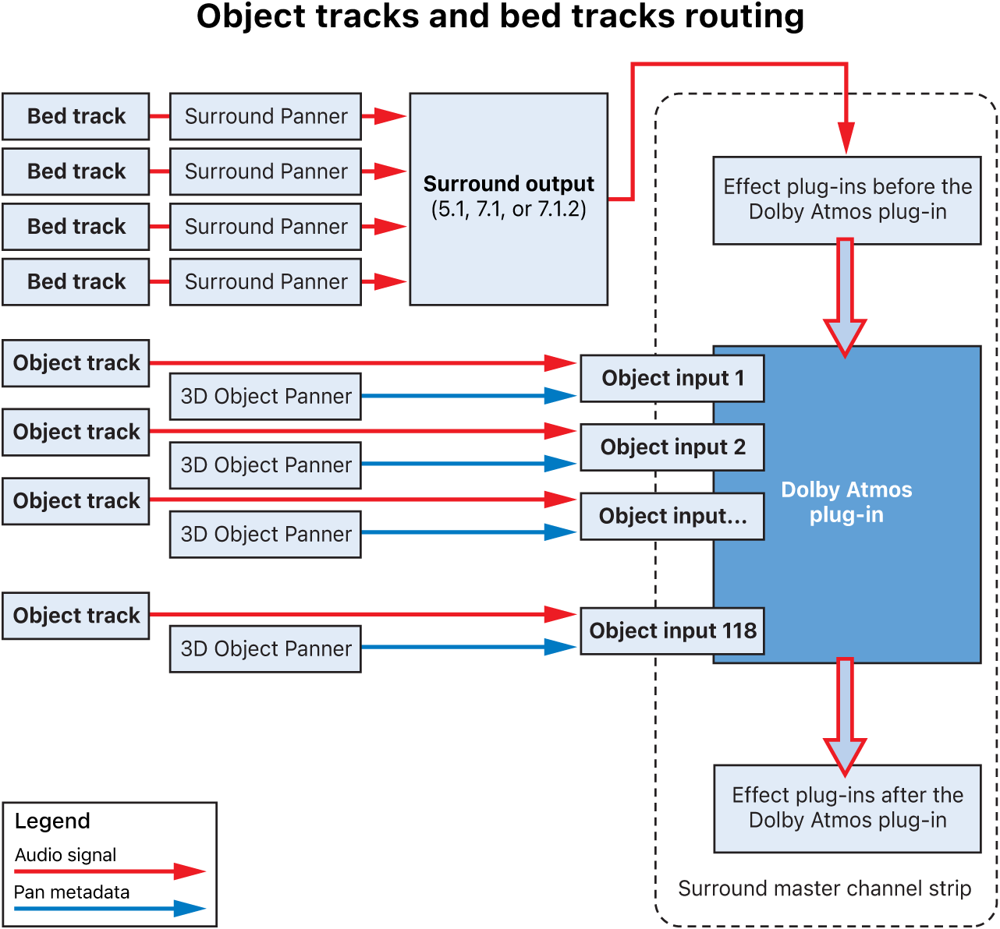
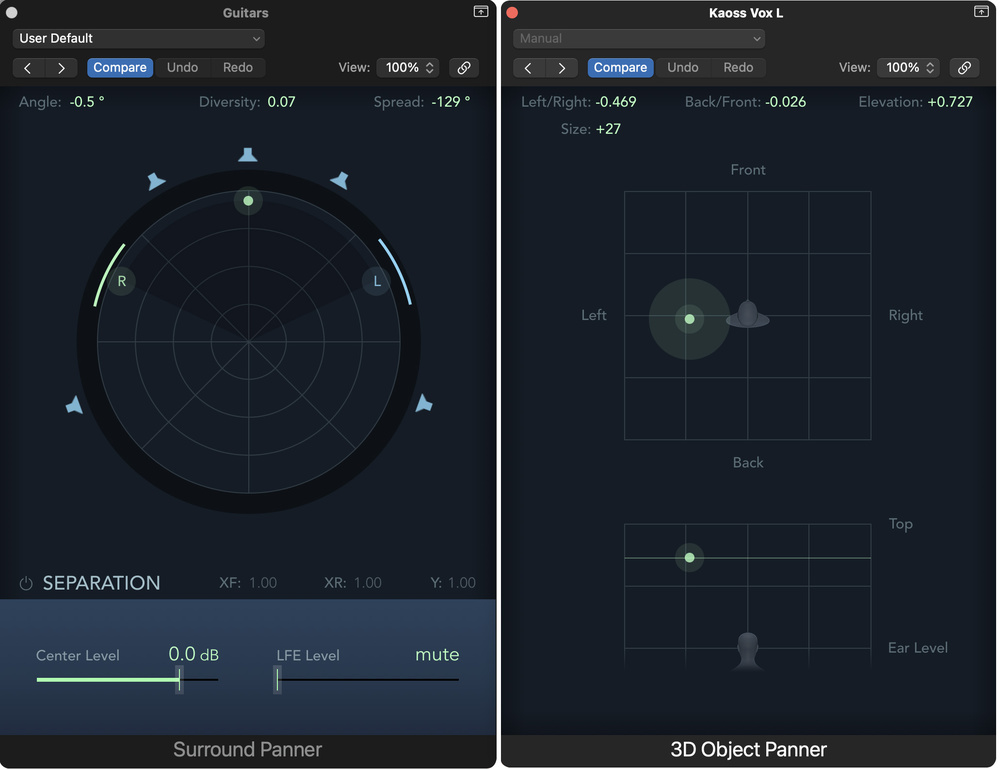

+++
title = "What is Dolby Atmos?"
outputs = ["Reveal"]
[reveal_hugo]
margin = 0.2
+++

# Why Atmos?

{}
Today I’m framing Atmos as a solution to three old problems:

1. Channel lock-in. Traditional formats (stereo, 5.1, 7.1) bind content to fixed speakers. Atmos decouples *mixing* from *playback* through objects and real-time rendering.

2. Scalability. The same master should travel from cinema to phone without bespoke downmixes. Atmos uses metadata and an adaptive renderer to target anything from 64-speaker dub stages to headphones. ([Dolby Professional][1])

3. Creative intent across devices. Object metadata lets me place and move sounds precisely; the renderer preserves those decisions on different layouts, including binaural. ([Dolby Professional Support][2])

By the end, students should be able to explain beds vs. objects, route a DAW to a renderer, export an ADM master, and evaluate delivery options for cinema, streaming, broadcast, games, automotive, and headphones.
{}

---

## From Mono to Immersive

* Mono → one source, no spatial field
* Stereo → phantom imaging between two speakers
* Surround → 2D ring of speakers at ear height
* Immersive → adds the vertical dimension (height)

{}
I’ll remind the class that “surround” historically meant ear-level rings (5.1/7.1). “Immersive” adds height: overhead loudspeakers or their virtualized equivalents. Dolby Atmos is one well-supported immersive ecosystem; you’ll also see Auro-3D, MPEG-H, Sony 360RA, and, more recently, IAMF/Eclipsa (open) and Apple’s ASAF/APAC on their platforms. We’ll circle back to those in “Current Developments.” ([Digital Trends][3])
{}

---

## The Gray Areas 

* Speaker vs. channel
* Mono vs. stereo (fully correlated stereo is still mono)
* Surround vs. immersive
* Ambisonics vs. Atmos
* Beds vs. objects (we’ll define precisely)

{}
I’ll clean up vocabulary early:

• Channels are signals; speakers are transducers.
• You can be surrounded by many speakers and still be hearing one mono channel (“super-mono”).
• Ambisonics is a scene-based capture/encode system; Atmos is object-based authoring plus rendering.
• In Atmos, a “bed” is a conventional multichannel stem (commonly 7.1.2); “objects” are individually positioned sound elements with metadata. ([Dolby Professional Support][4])
{}

---

## What Atmos Actually Is

* Object-based authoring plus a real-time renderer
* Typical music/post layout: 7.1.2 bed + up to 118 objects
* Total inputs to the renderer at 48 kHz: 128
* Renderer adapts to the room or device

{}
This is the core fact set I want students to memorize:

• Atmos projects combine one or more beds with objects.
• At 48 kHz the renderer accepts 128 inputs in total: at least 10 bed channels (7.1.2) and up to 118 objects; at 96 kHz it’s 64 total. ([Dolby Partner Support][5])
• The renderer maps that mix to whatever layout is present—64-speaker dub stages, 9.1.6 rooms, 5.1 soundbars, laptops, or headphones—without me hand-authoring separate downmixes. ([Dolby Professional][1])
{}

---

{}
**Speaking Notes**

This diagram comes directly from Apple’s *Logic Pro 11.2 User Guide* and shows how Logic routes Dolby Atmos audio differently depending on whether you’re using *bed* or *object* tracks.

**Bed Tracks**

* Act like conventional surround channels—think of them as your fixed speaker mix (L, R, C, LFE, Ls, Rs, Ltm, Rtm).
* Every bed track feeds into the same multichannel bus called the **surround bed**.
* You can set that bed to **5.1, 7.1, or 7.1.2** in Project Settings → Audio → Surround Format.
* The surround panner spreads signals across that multichannel bus before the Dolby Atmos plug-in.
* Logic supports only **one bed per project**, with up to **7.1.2** width (meaning one overhead stereo pair).
* Because of that limit, you can’t position sound at the *front or rear* of the ceiling—only at left/right top.

**Object Tracks**

* Each object track bypasses the surround bus and routes directly to the **Dolby Atmos plug-in**.
* Each object has a **3D Object Panner**, which sends both audio (red arrows) and pan metadata (blue arrows).
* Up to **118 objects** are available. Each stereo track uses two objects.
* Surround tracks can’t become objects—only mono or stereo sources.
* The 3D Object Panner defines X, Y, Z coordinates and motion automation.
* Logic keeps each object’s signal and metadata discrete all the way to the **ADM BWF master file**, the format delivered to Apple Music for Atmos releases.
* Note: You cannot route object tracks directly to the LFE channel.

**Summary**

* The *bed* represents traditional channel-based audio; *objects* are position-based elements in 3D space.
* Logic merges both through the Dolby Atmos plug-in on the surround master channel strip, where pre- and post-fader effects can still be inserted.

This is a great point to pause and show in Logic how a bed track’s surround panner differs from an object’s 3D Object Panner.
{}

---

**Surround Panner vs. 3D Object Panner in Logic Pro**

{}
**Speaking Notes**

This side-by-side shows how **Logic Pro 11’s** interface distinguishes between *channel-based* and *object-based* spatial control.

**Left – Surround Panner (Bed Track)**

* This is used on *bed* channels—traditional 5.1 / 7.1 / 7.1.2 buses.
* You’re panning within a fixed loudspeaker ring (L, R, C, Ls, Rs, LFE, Ltm, Rtm).
* The circular radar view represents azimuth—sounds move left-to-right or front-to-back within that 2-D plane.
* Height is not available here; any “top” contribution comes from the 7.1.2 bed pair only.
* Ideal for ambience, reverb returns, and music stems you want anchored to the speaker layout.

**Right – 3D Object Panner (Object Track)**

* Used when a track is routed as a *Dolby Atmos object*.
* Provides full 3-axis positioning: left/right (X), front/back (Z), and elevation (Y).
* Includes object *size* and *spread* controls—metadata sent to the renderer in real time.
* You can automate position or trajectory, enabling smooth motion through the 3-D field.
* In the Dolby Atmos plug-in, these become individual “object inputs” (up to 118 total).

**Pedagogical focus**
Demonstrate that the **surround panner is channel-dependent**, while the **3D object panner is spatially absolute**.
Ask students: *“What creative choices might push you toward an object rather than a bed—clarity, motion, or localization?”*
{}

---

## Atmos Delivery: Two Steps

| **Step**                  | **Format**                                  | **Used By**                                         |
| ------------------------- | ------------------------------------------- | --------------------------------------------------- |
| **1. Master**             | ADM BWF (beds + objects + metadata)         | Apple Music, Tidal, Amazon Music                    |
| **2. Playback Encode**    | DD+ JOC, TrueHD, AC-4 (from ADM)            | Netflix, Disney+, Blu-ray, ATSC 3.0                 |

**Key point:** Submit the **ADM BWF master**. Platforms encode to consumer formats internally.

{}
**Speaker Notes**

When we release Atmos music, we don't deliver a compressed bitstream — we deliver the *source master*: the **ADM BWF**.

**Why ADM BWF?**

* It’s the official Dolby Atmos master format.
* Contains every bed and object as discrete PCM plus spatial metadata.
* Apple uses that data to generate their own **Dolby Digital Plus JOC** version optimized for Apple Music’s Spatial Audio.
* This keeps future compatibility: if Apple updates headphone rendering or playback devices, your mix can be re-rendered from the same master.

**What not to send**

* Never send the *consumer bitstream* (e.g., DD+ JOC, TrueHD). Those are *playback encodes*, not submission assets.
* Think of DD+ JOC as the “end-user” product Apple generates from your ADM BWF.

**Example Workflow**

1. Export your Atmos mix as an **ADM BWF (.wav)** from Logic Pro, Pro Tools, or Nuendo.
2. Include the **stereo reference master** that matches time and content.
3. Deliver through your distributor (Apple Music for Artists, Tunecore, DistroKid, etc.) — they upload the ADM to Apple’s servers via iTunes Connect/Transporter.
4. Apple re-encodes internally into their own DD+ JOC format and generates binaural versions for Spatial Audio playback.

**Other platforms**

* **Tidal / Amazon Music HD:** also request ADM BWF masters (they transcode to DD+ JOC for playback).
* **Blu-ray / Netflix:** use *encoded bitstreams* (TrueHD or DD+ JOC), created *after* mastering, typically by a post-house.

**Takeaway**
Always deliver the **ADM BWF master** as your definitive Atmos source — it’s what streaming services expect and what ensures consistent, future-proof rendering across devices.

{}

---

## Rendering, Not Downmixing

* Speaker rendering adapts to any layout
* It’s object-aware, not a blind fold-down
* Same master serves cinema, home, mobile, and headphones

{}
I’ll emphasize that Atmos rendering isn’t a simple static downmix. It uses the objects’ positions and sizes to compute how much goes to each available speaker at playback time. That’s why the same ADM master can target a 64-speaker cinema or a 7.1.4 living room—and also why headphone binaural can preserve intent. ([Dolby Professional][1])
{}

---

## Binaural Rendering (Headphones)

* Per-object binaural modes: Off, Near, Mid, Far
* Used for Atmos on headphones (Apple Music, Tidal, etc.)
* Optional personalized HRTF on Apple devices

{}
Binaural is part of the official authoring flow. For each bed channel and object you can set binaural mode to adjust apparent distance. Most streaming headphone experiences respect these metadata. On Apple devices there’s also Personalized Spatial Audio: users scan ear/head geometry for a custom HRTF. I’ll demo both. ([Dolby Professional Support][2])
{}

---

## Delivery Formats at a Glance

* Streaming: Dolby Digital Plus JOC (object metadata inside DD+)
* Disc: Dolby TrueHD with Atmos metadata
* Broadcast: Dolby AC-4 (ATSC 3.0/NEXTGEN TV)
* Cinema: SMPTE IAB (Immersive Audio Bitstream) in DCP/IMF
* Apple TV 4K: Dolby MAT for Atmos to AVR/soundbar

{}
Quick mapping:

• Streaming apps typically use DD+ JOC; the JOC extension carries object info for the renderer. ([Dolby Professional Support][8])
• Blu-ray/UHD uses TrueHD, often with Atmos metadata embedded. ([Dolby Professional][9])
• U.S. broadcast via ATSC 3.0 uses AC-4; the spec supports up to 7.1.4 and objects. ([Digital Trends][3])
• Digital cinema has moved toward SMPTE IAB; Atmos rooms play IAB tracks. Labeling is shifting from “ATMOS” to “IAB” in many workflows. ([registry-page.isdcf.com][10])
• Apple TV 4K outputs Atmos as Dolby MAT (uncompressed PCM with metadata) over HDMI to a compatible AVR or soundbar. ([Apple Support][11])
{}

---

## Where You’ll Hear Atmos Today

* Cinema, streaming originals, and discs
* Major live sports and events in Atmos
* Games on Xbox and PS5
* Automotive systems
* Music catalogs on Apple Music, Tidal, Amazon Music

{}
Examples to cite in class:

• Comcast carried Super Bowl LIX in Dolby Atmos; Peacock now streams weekly Sunday Night Football in Atmos. ([The Verge][12])
• Xbox Series X|S has long supported Atmos; PS5 added Atmos output for games in 2023.
• Automakers like Lucid ship Atmos systems.
• Apple Music, Amazon Music, and Tidal carry Atmos music catalogs. Spotify still doesn’t offer native spatial/Atmos as of 2025. ([Apple][13])
{}

---

## DAW Support 

* Pro Tools Studio/Ultimate: integrated Dolby Atmos Renderer (2023.12+)
* Nuendo: internal Atmos authoring, 9.1.6 support, external renderer optional
* Logic Pro: built-in Atmos plugin and export workflow

{}
Pro Tools’ built-in renderer removed the external round-trip; 2024 updates added custom live re-renders. Nuendo 13 supports 9.1.6 channel config and internal authoring, with external renderer connectivity for advanced workflows. Logic Pro has offered a built-in Dolby Atmos plugin since 10.7 with clear bed/object tools. I’ll show all three briefly. ([Avid][6])
{}

---

## Dolby Atmos Composer – Fiedler Audio

* [fiedler-audio.com/dolby-atmos-composer/](https://fiedler-audio.com/dolby-atmos-composer/)
* “Produce Dolby Atmos content on any DAW”
* Key features:
  * Objects & beds routing, export ADM BWF compatible. 
  * Works in DAWs that do *not* have native multichannel support. 
  * Version 1.6 introduces OBAM for full 128-channel master bus processing. 

{}
* Introduce the tool:
  “Here’s a workflow alternative to the standard DAW + Dolby Atmos Renderer route. Fiedler Audio’s Dolby Atmos Composer lets you author, monitor, and export Atmos mixes from virtually any DAW.”
* Why it matters:
  • Many DAWs (especially in music production) still have limited multichannel routing support. The Composer bridges that gap. ([Sound on Sound][2])
  • For students working in studios without dedicated Atmos rooms or full rendering chains, this offers a more accessible entry point for immersive mixing.
* Core workflow explanation:
  • Use the **Beam** plugin to send track audio + metadata (objects or bed assignments) into the Composer environment. ([Dolby Professional Support][1])
  • In the Composer interface you select bed vs object roles, layout, monitoring format, and export to ADM BWF for delivery. ([Fiedler Audio][4])
* Key distinctions:
  • Full version vs Essential: the “Essential” version offers basic Atmos workflows; full version adds advanced monitoring, 128 channels, OBAM, etc. ([Bedroom Producers Blog][5])
  • The tool is approved by Dolby Labs, making exports compliant with standard Atmos delivery workflows. ([Fiedler Audio][6])
* Classroom tie-in:
  • Ask students: “Given our workflow constraints (e.g., stereo DAW, headphones only), how might Composer change your approach to an immersive project?”
  • For a practical lab: Have students install the demo version of Composer, route a stereo track via Beam, mark it as object vs bed in Composer, export an ADM BWF, and compare playback in projected stereo vs binaural headphones.
{}

---

## Current Developments (2024–2025)

* Dolby Atmos Renderer v5.0 released with updated licensing and docs
* Broadcast/streaming: more live sports in Atmos
* Open standard push: IAMF and Google/Samsung Eclipsa Audio for YouTube/TVs
* Apple platform: ASAF/APAC for spatial and positional audio across iOS/tvOS/visionOS
* Cinema exchange: increased use of SMPTE IAB labeling/workflows

{}
A concise industry briefing for students:

• Dolby released Atmos Renderer v5.0 with updated distribution and support materials; creators can upgrade from Production/Mastering Suite. ([Dolby Professional Support][14])
• Live sports: Atmos is becoming table stakes—Super Bowl LIX via Comcast, weekly SNF on Peacock, plus Olympics/other events trend toward object-based delivery. ([The Verge][12])
• Open standards: the IAMF spec under the AOMedia umbrella underpins Samsung/Google’s new “Eclipsa Audio,” positioned as an Atmos alternative for YouTube and 2025 TVs/soundbars. This is meaningful for students shipping content to open platforms. ([The Verge][15])
• Apple’s WWDC 2025 quietly introduced ASAF (Apple Spatial Audio Format) and APAC (Apple Positional Audio Codec) for head-tracked immersive on Apple devices and visionOS; not an instant Atmos replacement, but important on Apple platforms. ([TechRadar][16])
• In cinema, Atmos playback supports SMPTE IAB; many workflows now label tracks “IAB” rather than “ATMOS.” Students should recognize both terms in DCP/IMF deliverables. ([registry-page.isdcf.com][10])
{}

---



## The Other Camp: MPEG-H

* Fraunhofer's NGA codec, the main alternative to Dolby's stack
* Broadcast: chosen for ATSC 3.0 in South Korea, on air in Brazil since 2021 (US broadcast chose Dolby AC-4)
* Music: Sony 360 Reality Audio is built on MPEG-H
* Its differentiator: listener interactivity — the viewer can raise dialogue or change the balance at home

{}
Who wins where: the US broadcast market went AC-4, Korea and Brazil went MPEG-H, Europe's DVB supports both. On the music side, 360 Reality Audio (Amazon Music, Tidal, nugs) is the MPEG-H ecosystem answer to Atmos music. The interactivity point is the conceptual difference worth dwelling on: MPEG-H metadata can expose sliders to the listener (dialogue level, home-team vs away-team commentary), while Atmos playback is fixed by the mixer. Ask: which model do you want as a mixer? As a listener?
{}

---

#### Services Snapshot

* Apple Music, Tidal, Amazon Music: Atmos catalogs
* Spotify: no native spatial/Atmos as of 2025

{}
Students always ask: “Does Spotify have Atmos?” Not yet, officially. There are OS-level “spatialize stereo” tricks, but those are not true Atmos. This helps them pick targets for capstone releases. ([Apple][13])
{}

